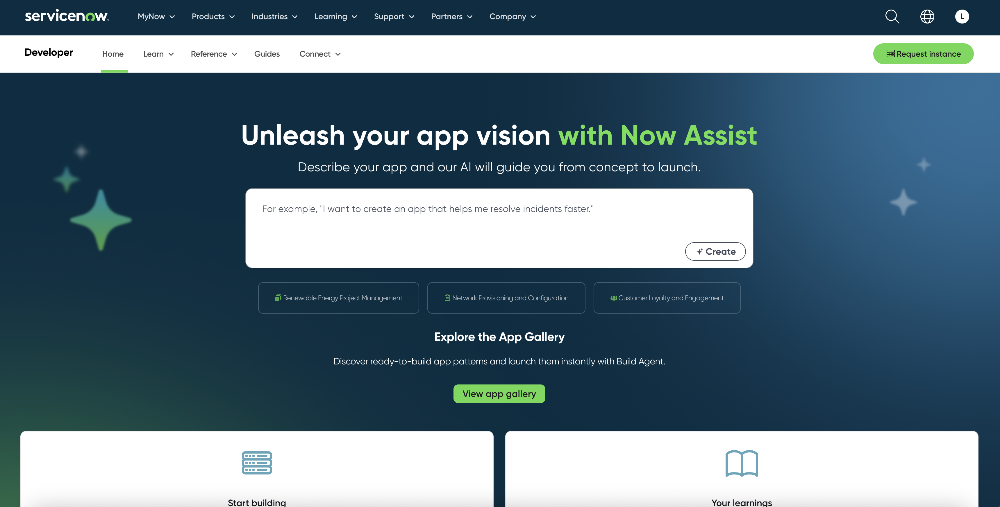
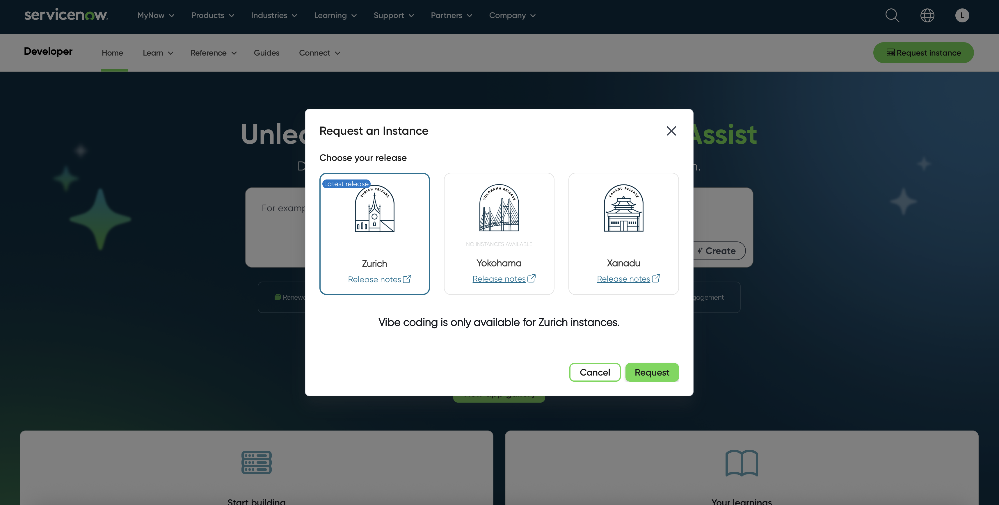
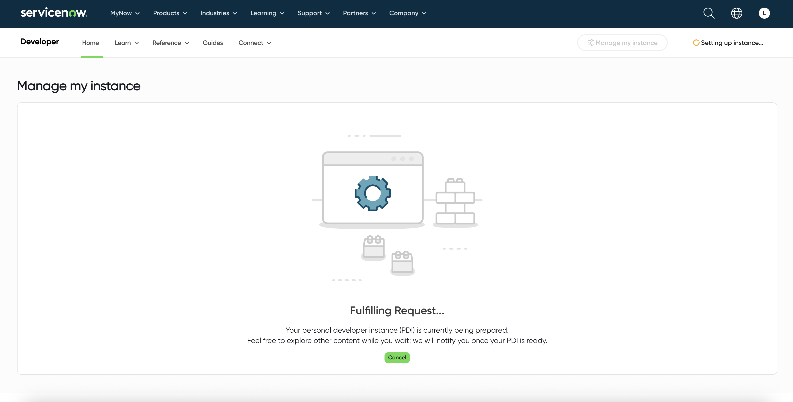

# Instructor Guide

## 🛠️ Set up ServiceNow Instance

1. **Get ServiceNow Instance:**
   - Go to https://developer.servicenow.com/dev.do#!/home
   - Sign up or log in
   - Request a Personal Developer Instance (PDI)
   - Note your instance name (e.g., `dev12345`)





**Important**: After an extended period of non-use, the ServiceNow instance will hibernate. To wake it up, just re-login and there will be an option to wake it. It takes a few minutes, so make sure to confirm that the instance is live before starting the labs

2. **Configure environment:**
   On the instance landing page  
   - Note "user name" (`admin`) and "current password"
   - Save them to root [.env](.env) with env variable names:
   ```
      SERVICENOW_INSTANCE=dev12345
      SERVICENOW_USERNAME=admin
      SERVICENOW_PASSWORD=aBcDEfG1234
   ```


3. **Share the .env with your participants so that they can connect**
   ```
      SERVICENOW_INSTANCE=dev12345
      SERVICENOW_USERNAME=admin
      SERVICENOW_PASSWORD=aBcDEfG1234
   ```