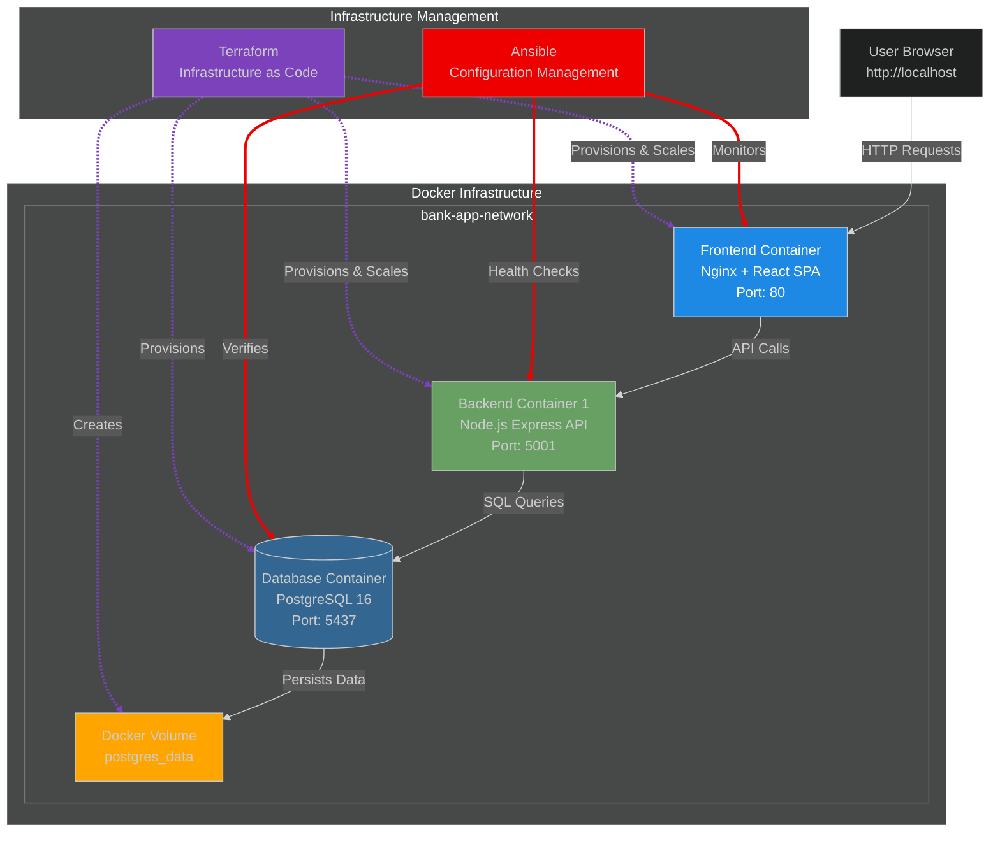
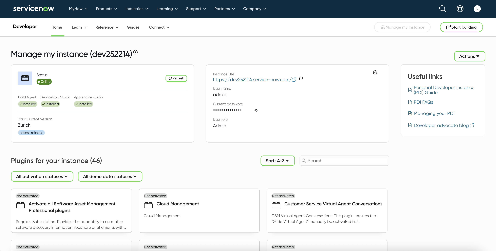
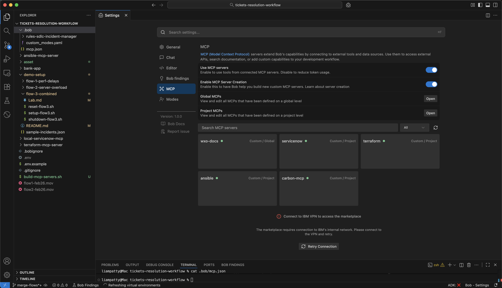
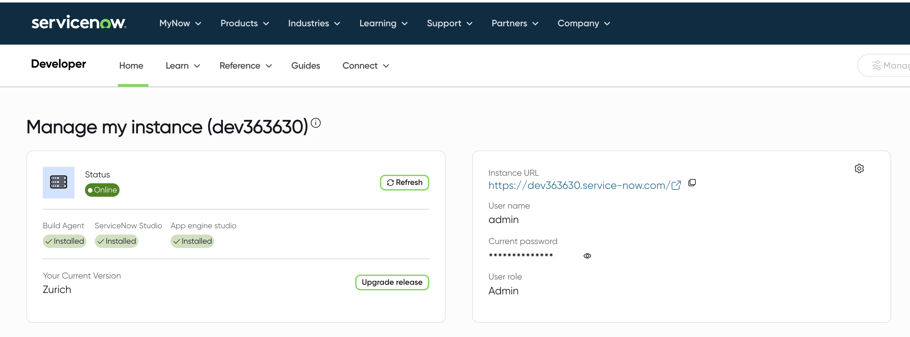
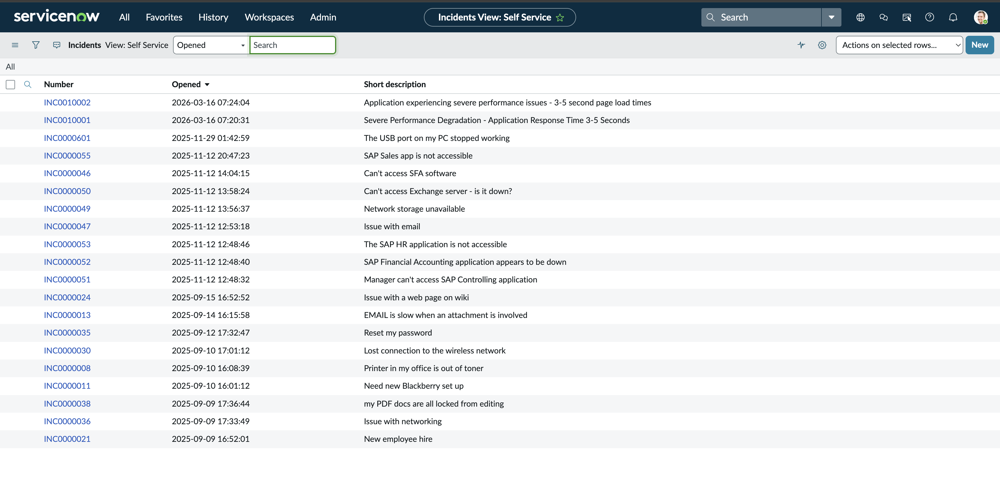
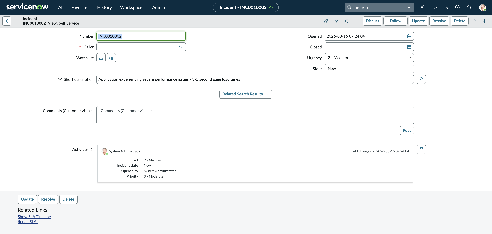
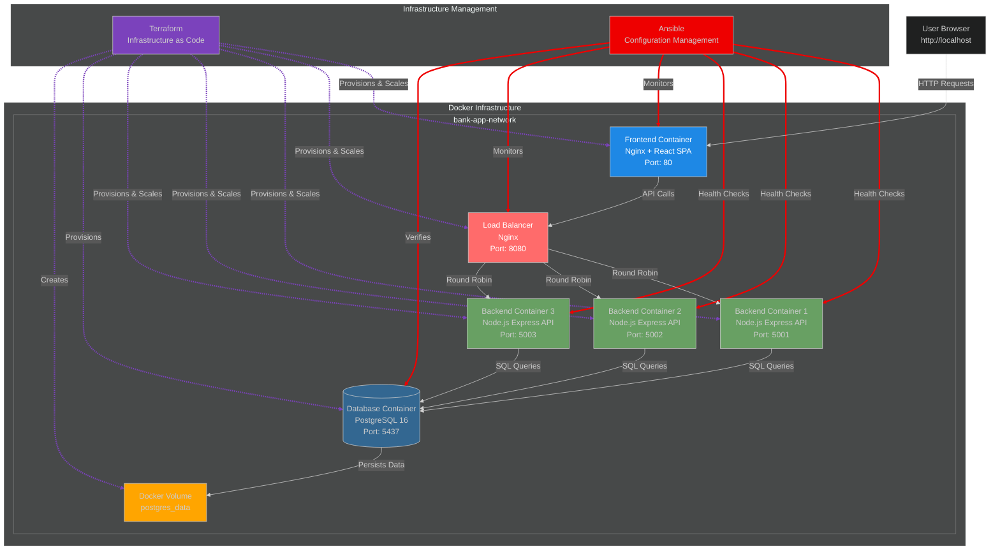

# 🎓 Lab Walkthrough: SDLC Incident Management with Bob

## 📋 Lab Overview

In this hands-on lab, you'll experience a realistic incident management scenario where:
- You'll first deploy and explore a working bank application
- Then simulate a production incident with performance degradation
- Users report 3-5 second page load times
- The root cause is an under-provisioned backend (single replica) that's overloaded
- You'll use Bob (AI IDE partner) to diagnose and resolve the issue using SDLC best practices

**Learning Objectives:**
1. Understand the application architecture and normal operation
2. Create and track incidents in ServiceNow
3. Use automated diagnostics to identify root causes
4. Apply infrastructure scaling with Terraform
5. Verify resolution with metrics
6. Document the complete incident lifecycle

---

## 🏗️ Application Architecture



**Infrastructure Management:**

- **Terraform (Purple)**
  - Provisions all Docker containers
  - Creates network and volumes
  - Scales backend replicas (1 → 3)
  - Manages infrastructure state
  - Destroys resources on cleanup

- **Ansible (Red)**
  - Runs health checks on all services
  - Monitors application performance
  - Verifies database connectivity
  - Executes diagnostic playbooks
  - Applies configuration fixes

---

## 🛠️ Part 1: Environment Setup (5 minutes)

### Step 1.1: Verify Prerequisites

Check that all required tools are installed:

```bash
# Check Docker/Colima
docker ps
# Should show running containers or empty list (not an error)

# Check Terraform
terraform version
# Should show: Terraform v1.x.x

# Check Ansible
ansible --version
# Should show: ansible [core 2.x.x]

# Check Node.js (for MCP servers)
node --version
# Should show: v20.x.x or higher
```

---

### Step 1.2: Configure ServiceNow Credentials

Your instructor will provide a `.env` file to connect to the existing ServiceNow instance.

1. **Configure environment:**
   On the instance landing page  
   - Note "user name" (`admin`) and "current password"
   - Save them to root [.env](.env) with env variable names:
   ```
      SERVICENOW_INSTANCE=dev12345
      SERVICENOW_USERNAME=admin
      SERVICENOW_PASSWORD=aBcDEfG1234
   ```



---

### Step 1.3: Build MCP Servers

Build the three MCP servers that Bob will use:

```bash
# Run the automated build script
./build-mcp-servers.sh
```

**What are MCP Servers?**

MCP (Model Context Protocol) servers provide Bob with tools to interact with external systems. Each server exposes specific capabilities:

**1. ServiceNow MCP Server** (`local-servicenow-mcp/`)
- **Purpose**: Connect to ServiceNow for incident management and tracking
- **Tools Provided:**
  - `create_incident` - Create new incidents in ServiceNow
  - `update_incident` - Update incident status and work notes
  - `get_incident` - Retrieve incident details
  - `list_incidents` - List incidents by state, assignee, or activity
  - `search_knowledge` - Search ServiceNow knowledge articles
  - `get_user` - Look up ServiceNow users

**2. Ansible MCP Server** (`ansible-mcp-server/`)
- **Purpose**: Configuration management and diagnostics
- **Tools Provided:**
  - `run_playbook` - Execute Ansible playbooks for automation
  - `run_adhoc` - Execute ad-hoc Ansible modules and shell commands
  - `list_inventory` - Inspect inventory hosts and groups
  - `validate_playbook` - Validate playbook syntax
  - `get_facts` - Gather host facts for diagnostics
  - `create_playbook` - Generate playbooks when needed
  - Available playbooks include:
    - `health-check.yml` - Check service health and response times
    - `deploy.yml` - Deploy application updates
    - `rollback.yml` - Rollback to previous version
    - `backup-database.yml` - Backup database
    - `update-config.yml` - Update configuration files

**3. Terraform MCP Server** (`terraform-mcp-server/`)
- **Purpose**: Infrastructure provisioning and scaling
- **Tools Provided:**
  - `terraform_init` - Initialize Terraform working directory
  - `terraform_plan` - Preview infrastructure changes
  - `terraform_apply` - Apply infrastructure changes
  - `terraform_destroy` - Destroy infrastructure
  - `terraform_show` - Show current infrastructure state
  - `terraform_validate` - Validate Terraform configuration
  - `terraform_fmt` - Format Terraform files
  - `terraform_state_list` - List resources in state
  - `terraform_output` - Read Terraform outputs
  - `terraform_workspace_list` - List available workspaces
  - `terraform_workspace_new` - Create a workspace
  - `terraform_workspace_select` - Select a workspace
  - `create_terraform_config` - Generate sample Terraform config

**How Bob Uses These Tools:**

When you report an incident, Bob orchestrates these tools to:
1. **Create incident** in ServiceNow (ServiceNow MCP)
2. **Run health checks** to diagnose issues (Ansible MCP)
3. **Scale infrastructure** if needed (Terraform MCP)
4. **Verify resolution** with health checks (Ansible MCP)
5. **Update and resolve** the incident (ServiceNow MCP)

These MCP servers are made available to Bob at [.bob/mcp.json](.bob/mcp.json).

> **Bob v2 note:** The MCP entries currently require full absolute paths for server `args` and `cwd` values. After cloning this repo, update the paths in [.bob/mcp.json](.bob/mcp.json) to match your local machine before using the lab.

You can verify their validity by opening up Bob settings and navigating to MCP. All three servers should display a green dot:



## 🏦 Part 2: Deploy and Explore the Working Application

### Step 2.1: Deploy the Application (Initial State - Low Traffic)

First, let's deploy the application as it would be during normal, low-traffic periods:

```bash
./demo-scripts/deploy-initial.sh
```

**What this script does:**
1. Checks prerequisites (Docker, Terraform)
2. Initializes Terraform if needed
3. Configures `terraform.tfvars` with `backend_replicas = 1`
4. Deploys infrastructure with Terraform
5. Waits for services to be ready
6. Verifies application health
7. Displays access information and next steps

**Infrastructure deployed:**
- Docker network for the application
- PostgreSQL database with persistent storage
- **1 backend API instance** (adequate for low traffic)
- Frontend with Nginx serving React SPA
- All services configured with health checks

**Expected Output:**
```
╔════════════════════════════════════════════════════════════╗
║                    ✓ Deployment Complete!                 ║
╚════════════════════════════════════════════════════════════╝

Application Status:
  • Frontend:  http://localhost
  • Backend:   http://localhost:5001
  • Database:  localhost:5437

Infrastructure:
  • Backend replicas: 1 (adequate for low traffic)
  • Performance: Normal (<1 second response times)
  • Status: Healthy, no issues
```

---

### Step 2.2: Explore the Bank Application

Now let's explore the application as a user would:

Go to [http://localhost](http://localhost)

**Key Observations:**
- ✅ Pages load instantly (<1 second)
- ✅ Transactions process immediately
- ✅ No delays or timeouts
- ✅ Smooth user experience

---

## 🚨 Part 3: Simulate Traffic Surge Incident

Now that you understand the application under low load, let's simulate what happens when there's a sudden surge in user activity (e.g., payday, marketing campaign, viral social media post).

### Step 3.1: Simulate the Traffic Surge

Execute the automated setup script to simulate increased load:

```bash
./demo-scripts/setup-flow.sh
```

Go to [http://localhost](http://localhost) and test out the delayed response times.

**What this simulates:**
- **Traffic surge**: Sudden increase in concurrent users
- **Overload metrics**: CPU 95%, Memory 88%, 450 req/s (vs. normal 50 req/s)
- **Performance degradation**: 3-second delays 
- **The single backend replica can't handle the surge**

**Real-world scenario:**
- It's payday and everyone is checking their accounts
- A marketing campaign just launched
- Social media post went viral
- Black Friday / Cyber Monday traffic

Your single backend instance is now the bottleneck!

---

## 🎯 Part 4: Incident Management with Bob (10 minutes)

### Step 4.1: Inspect "🎫 SDLC Incident Manager" mode

1. Open Bob
2. Click the mode selector
3. Select the settings indicator
4. Open `SDLC Incident Manager` mode
5. Skim the mode instructions


---

### Step 4.2: Select "🎫 SDLC Incident Manager" mode

1. Open Bob
2. Click the mode selector
3. Open `SDLC Incident Manager` mode


### Step 4.3: Report the Incident to Bob

Copy and paste this incident report to Bob:

```
Users are reporting severe performance issues. Application is very slow, taking 3-5 seconds to load pages.
```

Watch (and approve actions) as Bob:  
- Uses the ServiceNow MCP server to create a new incident
  - How to get to servicenow tickets page to verify incident creation:
      - Go to https://developer.servicenow.com/dev.do
      - Select Manage Instance as shown in the highlighted box
      
      - Open the instance URL listed as e.g. https://dev252214.service-now.com/
      
      - Once in your instance, select All in the top left and search for incidents
      
      - Select incidents and it will take you to the incident management board. By default there is a filter for active and caller=sys admin. This can be removed to view all
      
      - You can directly go to your incident created from bob by typing Incident ID in the search bar
      
  
- Identifies the cause of the issue
   - Queries the server metrics endpoint to assess status
   - Runs the Ansible healthcheck playbook
   - Updates the ServiceNow issue with findings
- Takes steps to resolve the issue
   - Updates Terraform configuration to scale backends horizontally
   - Creates a load balancer with nginx
   - Initializes, plans, and applies the new terraform IaC
- Confirms resolution
   - Verifies all containers are running properly
   - Checks server metrics again to confirm fix
   - Runs Ansible health check playbook to confirm fix
   - Verifies the load balancer is correctly distributing traffic
   - Update and close the ServiceNow incident with documentation

Revisit [http://localhost](http://localhost) to check that the delay issue has been fixed.


## 🏗️ Resolved Architecture (After Bob's Fix)



**Key Changes After Resolution:**
- ✅ **3 Backend replicas** (scaled from 1)
- ✅ **Load Balancer added** (Nginx on port 8080)
- ✅ **Traffic distributed** across all backends via round-robin
- ✅ **Each backend handles ~150 req/s** instead of 450 req/s
- ✅ **CPU/Memory normalized** across instances
- ✅ **Response times restored** to <1 second

---

## 🧹 Part 5: Cleanup

Tear down all infrastructure:

```bash
./demo-scripts/shutdown-flow.sh
```

This will:
- Clear all metrics and delays
- Destroy Terraform infrastructure
- Remove all containers and networks
- Reset configuration to defaults

---
