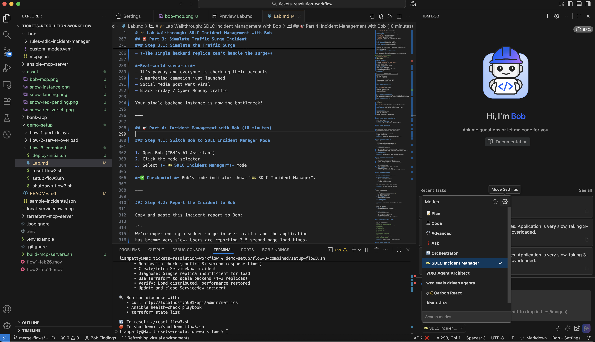
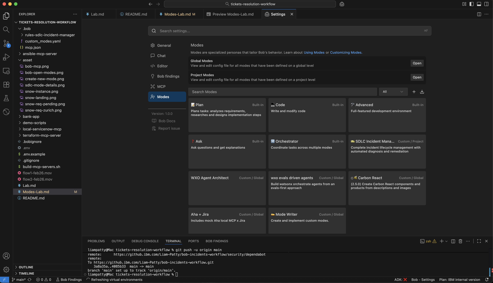
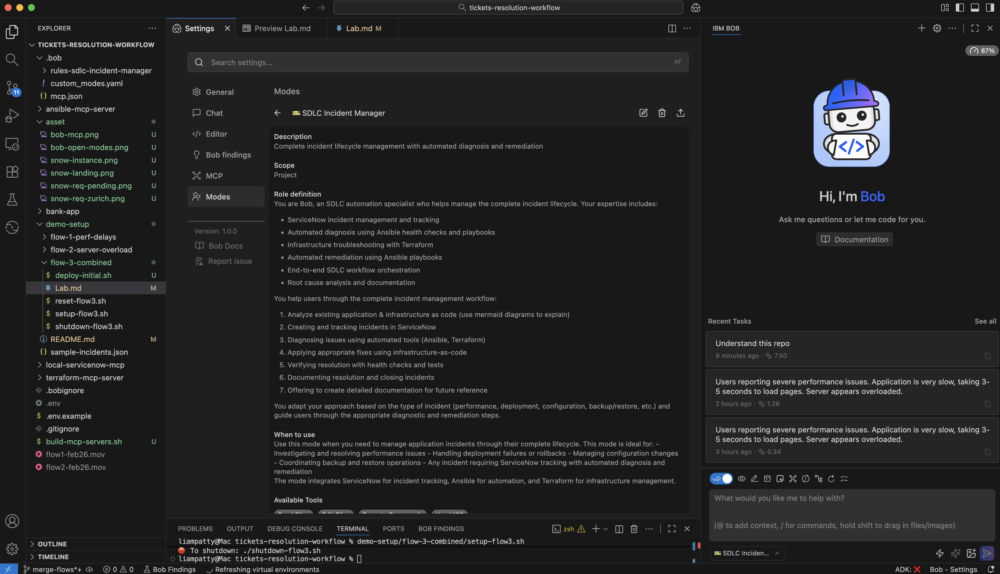
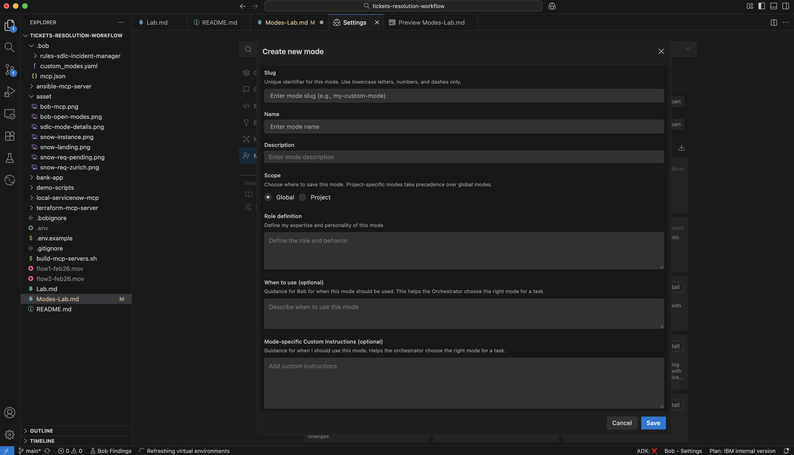

# 🎨 [DRAFT] Bob Modes Mini-Lab
---

## 📋 Lab Overview

In this mini-lab, you'll:
1. Understand what Bob modes are and how they work
2. Explore the SDLC Incident Manager mode structure
3. Create a custom mode from scratch (basic foundations)
4. Use Mode Writer mode to enhance your custom mode
5. Test and iterate on your mode

**Learning Objectives:**
- Understand mode configuration files and structure
- Learn the key components of a mode (workflow, best practices, tools)
- Practice creating mode instructions in XML format
- Use Mode Writer mode to accelerate mode development

---

## Part 1: Understanding Bob Modes

### What Are Bob Modes?

Bob modes are specialized configurations that change Bob's behavior, knowledge, and available tools for specific tasks. Think of them as "expert personas" that Bob can switch between.

**Key Concepts:**
- **Mode = Specialized Behavior** - Each mode makes Bob an expert in a specific domain
- **Instructions = XML Files** - Modes are defined using XML instruction files
- **Tools = MCP Servers** - Modes can specify which tools Bob should use
- **Context = Focused Knowledge** - Modes provide domain-specific knowledge and workflows

### Mode File Structure

Bob modes are stored in `.bob/` directory:

```
.bob/
├── mcp.json                          # MCP server configurations
├── modes.yaml                        # Mode definitions and metadata
└── rules-{mode-slug}/               # Mode instruction files
    ├── 1_workflow.xml               # Core workflow and process
    ├── 2_best_practices.xml         # Domain best practices
    ├── 3_tools.xml                  # Tool usage guidelines
    └── 4_examples.xml               # Examples and templates
```

### Anatomy of a Mode

**1. Mode Definition (modes.yaml)**

1. Open Bob
2. Click the mode selector
3. Select the settings indicator
4. Select the `SDLC Incident Manager` mode






The project-level mode descriptions are stored in [.bob/custom_modes.yaml](.bob/custom_modes.yaml)

**2. Instruction Files (XML)**
- Provide context, workflows, and guidelines
- Written in XML format for structure
- Can include examples, templates, and best practices
- Bob reads these when the mode is active

E.g., see [.bob/rules-sdlc-incident-manager/4_quick_reference.xml](.bob/rules-sdlc-incident-manager/4_quick_reference.xml)

```
<?xml version="1.0" encoding="UTF-8"?>
<incident_management_quick_reference>
  <overview>
    Quick reference guide for SDLC incident management using Bob with
    ServiceNow, Ansible, and Terraform integration.
  </overview>

  <incident_workflow_checklist> ... </incident_workflow_checklist>
  <incident_type_quick_guide> ... </incident_type_quick_guide>
  <servicenow_quick_reference> ... </servicenow_quick_reference>
  <ansible_quick_reference> ... </ansible_quick_reference>
  <common_commands> ... </common_commands>
  <troubleshooting_quick_guide> ... </troubleshooting_quick_guide>
  <communication_templates> ... </communication_templates>
  <best_practices_summary> ... </best_practices_summary>
  <success_criteria> ... </success_criteria>
</incident_management_quick_reference>
```

---

## Part 2: Creating a Custom Mode from Scratch

Let's create a simple "Code Reviewer" mode that helps review your code base.

### Step 2.1: Create a new mode

1. Open Bob
2. Click the mode selector
3. Select the settings indicator
4. Click the plus button to create a new mode  




Then add the following basic details

```yaml
  slug: code-reviewer
  name: 🔍 Code Reviewer
  description: Reviews code changes for quality, security, and best practices
  role definition: You are a code reviewer helping to ensure code quality, security, and maintainability. Focus on security, code quality, performance, test coverage, and documentation
  available tools: read files
```

### Step 2.2: Create Basic Instructions

Create a simple instruction file to get started. Bob's Mode Writer will help flesh out the details.

1. Create the mode directory:
```bash
mkdir -p .bob/rules-code-reviewer
```

2. Create a basic instruction file `.bob/rules-code-reviewer/1_workflow.xml`:

```xml
<instructions>
  <instruction>
    <title>Code Review Workflow</title>
    <content>
You are a code reviewer helping to ensure code quality, security, and maintainability.

# Basic Process
1. Read and understand the code changes
2. Check for code quality, security issues, and bugs
3. Provide constructive feedback with specific suggestions
4. Summarize findings and provide overall recommendation

# Focus Areas
- Security vulnerabilities
- Code quality and readability
- Performance concerns
- Test coverage
- Documentation
    </content>
  </instruction>
</instructions>
```

3. Save the file and test your basic mode by switching to "👀 Code Reviewer" mode and opening a new chat:
```
Please review this codebase
```

---

## Part 3: Enhance Your Mode with Mode Writer

Now let's use Bob's Mode Writer mode to transform your basic instructions into a comprehensive mode.

### Step 3.1: Switch to Mode Writer Mode

1. Open Bob
2. Click mode selector
3. Select "✍️ Mode Writer"


### Step 3.2: Request Enhancements

Ask Mode Writer to enhance your mode:

```
Please flesh out the `code-reviewer` mode, it is currently a basic draft implementation. Include:
1. Workflow
2. Best Practices
3. Tool Usage
4. Examples
```

### Step 3.3: Review Generated Files

Mode Writer will create comprehensive instruction files. Review and explore them:

- `Mode definition`: .bob/custom_modes.yaml
- `Workflow XML`: .bob/rules-code-reviewer/1_workflow.xml
- `Best Practices XML`: .bob/rules-code-reviewer/2_best_practices.xml
- `Tool Usage XML`: .bob/rules-code-reviewer/3_tool_usage.xml
- `Examples XML`: .bob/rules-code-reviewer/4_examples.xml

### Step 3.4: Test the Enhanced Mode

1. Switch back to "👀 Code Reviewer" mode
```
Please review this codebase
```

2. And compare to the previous results

**Expected improvements:**
- Bob follows the detailed workflow
- Applies specific best practices
- Uses appropriate tools (read_file, search_files)
- Provides structured feedback based on examples

