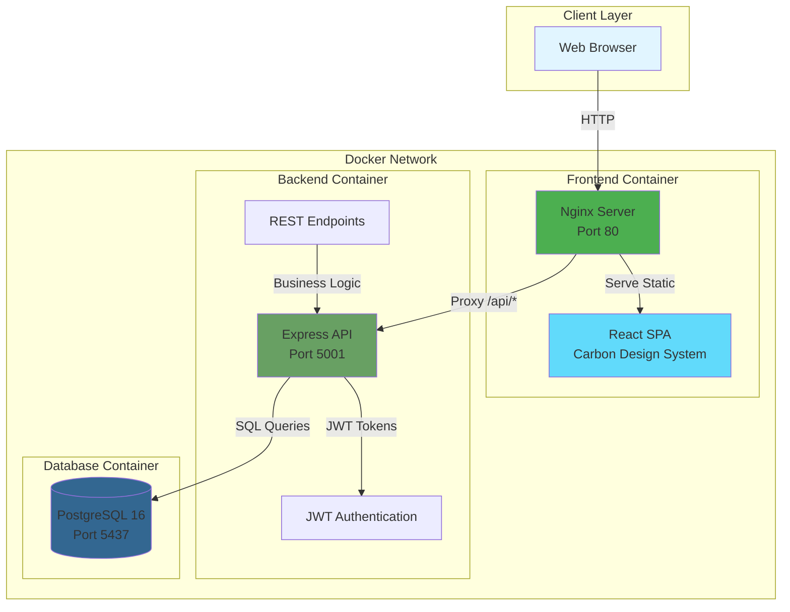
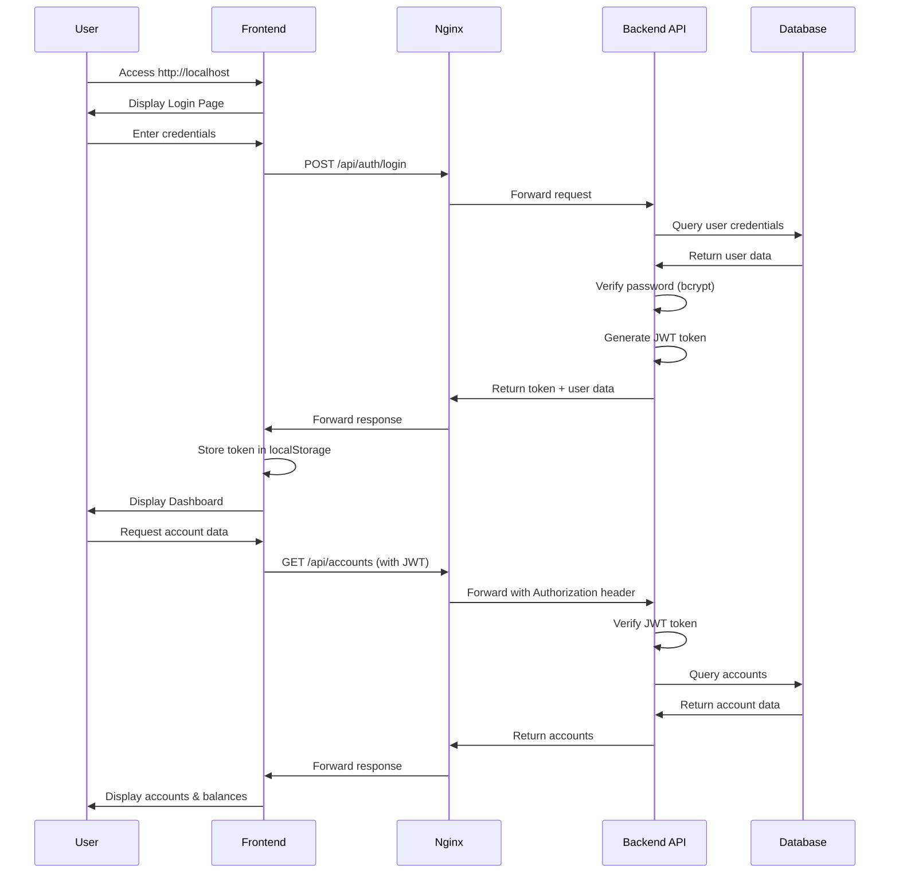
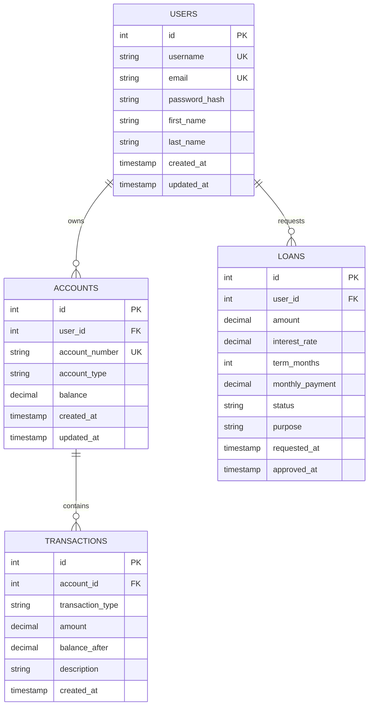
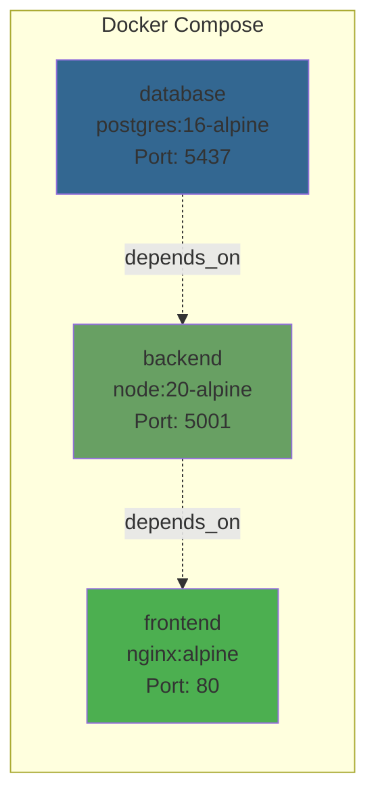
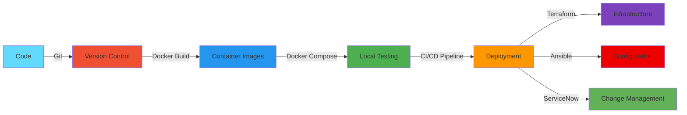

# 🏦 Bank Simulator - SDLC Demo Application

A full-stack banking application built with React, Node.js, PostgreSQL, and Docker, featuring IBM Carbon Design System. This application demonstrates modern SDLC practices including containerization, CI/CD readiness, and infrastructure as code.

## 🎯 Quick Start

```bash
# Start all services
docker-compose up -d

# Access the application
open http://localhost

# Demo credentials
Username: demo
Password: demo123
```

## 📊 Architecture



## 🔄 Application Flow



## 🗄️ Database Schema



## 🏗️ Project Structure

```
bank-app/
├── docker-compose.yml          # Multi-container orchestration
├── backend/
│   ├── Dockerfile             # Backend container definition
│   ├── package.json           # Node.js dependencies
│   └── src/
│       ├── server.js          # Express application entry
│       ├── db/
│       │   ├── database.js    # PostgreSQL connection pool
│       │   ├── schema.sql     # Database schema & seed data
│       │   └── init.js        # Database initialization
│       ├── middleware/
│       │   ├── auth.js        # JWT authentication
│       │   └── validation.js  # Request validation
│       └── routes/
│           ├── auth.js        # Authentication endpoints
│           ├── accounts.js    # Account management
│           └── loans.js       # Loan operations
└── frontend/
    ├── Dockerfile             # Frontend container definition
    ├── nginx.conf             # Nginx configuration
    ├── package.json           # React dependencies
    ├── .env.production        # Production environment vars
    └── src/
        ├── App.jsx            # Main application component
        ├── App.scss           # Carbon Design System styles
        ├── components/        # React components
        │   ├── Login.jsx
        │   ├── Dashboard.jsx
        │   ├── Deposit.jsx
        │   ├── Withdraw.jsx
        │   ├── AccountStatement.jsx
        │   ├── LoanRequest.jsx
        │   └── LoanDetails.jsx
        └── services/
            └── api.js         # Axios API client
```

## 🚀 Features

### Banking Operations
- ✅ User authentication with JWT
- ✅ Multiple account types (Checking, Savings)
- ✅ Deposit and withdrawal transactions
- ✅ Transaction history with filtering
- ✅ Loan requests and approvals
- ✅ Loan payment calculations

### Technical Features
- ✅ Docker containerization
- ✅ Multi-stage builds for optimization
- ✅ Health checks for all services
- ✅ Nginx reverse proxy
- ✅ PostgreSQL with persistent volumes
- ✅ IBM Carbon Design System
- ✅ JWT-based authentication
- ✅ Bcrypt password hashing
- ✅ RESTful API design

## 🔧 API Endpoints

### Authentication
```
POST /api/auth/register    # Register new user
POST /api/auth/login       # Login and get JWT token
```

### Accounts
```
GET    /api/accounts              # Get all user accounts
GET    /api/accounts/:id          # Get specific account
POST   /api/accounts              # Create new account
POST   /api/accounts/:id/deposit  # Deposit funds
POST   /api/accounts/:id/withdraw # Withdraw funds
GET    /api/accounts/:id/transactions # Get transaction history
```

### Loans
```
GET    /api/loans              # Get all user loans
GET    /api/loans/:id          # Get specific loan
POST   /api/loans/request      # Request new loan
POST   /api/loans/calculate    # Calculate loan payments
POST   /api/loans/:id/approve  # Approve loan (admin)
POST   /api/loans/:id/reject   # Reject loan (admin)
```

## 🐳 Docker Services



### Service Details

| Service | Image | Ports | Health Check |
|---------|-------|-------|--------------|
| database | postgres:16-alpine | 5437:5432 | `pg_isready -U postgres` |
| backend | Custom (Node 20) | 5001:5001 | `GET /health` |
| frontend | Custom (Nginx) | 80:80 | `wget --spider localhost` |

## 🔐 Security Features

- **Password Hashing**: Bcrypt with salt rounds of 10
- **JWT Tokens**: Signed with HS256 algorithm, 24-hour expiration
- **SQL Injection Prevention**: Parameterized queries
- **CORS Protection**: Configured origin restrictions
- **Input Validation**: Request body validation middleware
- **Secure Headers**: Nginx security headers configured

## 📦 Environment Variables

### Backend
```env
NODE_ENV=production
PORT=5001
DB_HOST=database
DB_PORT=5432
DB_NAME=bankdb
DB_USER=postgres
DB_PASSWORD=password
JWT_SECRET=your-secret-key-here
CORS_ORIGIN=http://localhost
```

### Frontend
```env
VITE_API_URL=/api
```

## 🛠️ Development

### Prerequisites
- Docker Desktop or Colima
- Node.js 20+ (for local development)
- PostgreSQL 16+ (for local development)

### Local Development Setup

```bash
# Backend
cd backend
npm install
npm run dev

# Frontend
cd frontend
npm install
npm run dev
```

### Database Management

```bash
# Access PostgreSQL CLI
docker-compose exec database psql -U postgres -d bankdb

# View logs
docker-compose logs -f backend
docker-compose logs -f frontend
docker-compose logs -f database

# Restart services
docker-compose restart backend
docker-compose restart frontend
```

## 🧪 Testing

```bash
# Test login API
curl -X POST http://localhost/api/auth/login \
  -H "Content-Type: application/json" \
  -d '{"username":"demo","password":"demo123"}'

# Test accounts API (with token)
curl http://localhost/api/accounts \
  -H "Authorization: Bearer YOUR_JWT_TOKEN"
```

## 📈 SDLC Integration

This application is designed to demonstrate modern SDLC practices:



### Planned Integrations
- **Terraform**: Infrastructure as Code for cloud deployment
- **Ansible**: Configuration management and automation
- **ServiceNow**: Change management and incident tracking
- **CI/CD**: Automated testing and deployment pipelines

## 🐛 Troubleshooting

### Port Conflicts
```bash
# Check if ports are in use
lsof -i :80
lsof -i :5001
lsof -i :5437

# Stop conflicting services
docker-compose down
```

### Database Connection Issues
```bash
# Verify database is running
docker-compose ps database

# Check database logs
docker-compose logs database

# Recreate database
docker-compose down -v
docker-compose up -d
```

### Frontend Not Loading
```bash
# Check nginx logs
docker-compose logs frontend

# Verify build artifacts
docker-compose exec frontend ls -la /usr/share/nginx/html

# Rebuild frontend
docker-compose up -d --build frontend
```

## 📝 Demo Accounts

| Username | Password | Account Types | Loan Status |
|----------|----------|---------------|-------------|
| demo | demo123 | Checking ($5,000)<br/>Savings ($10,000) | 1 Approved ($50,000) |
| john.doe | demo123 | Checking ($2,500) | None |

## 🤝 Contributing

This is a demo application for SDLC training. For production use, consider:
- Environment-specific configurations
- Secrets management (HashiCorp Vault, AWS Secrets Manager)
- SSL/TLS certificates
- Rate limiting and API throttling
- Comprehensive error handling
- Audit logging
- Backup and disaster recovery
- Monitoring and alerting (Prometheus, Grafana)

## 📄 License

MIT License - Built for educational and demonstration purposes.

---

**Made with Bob** 🤖