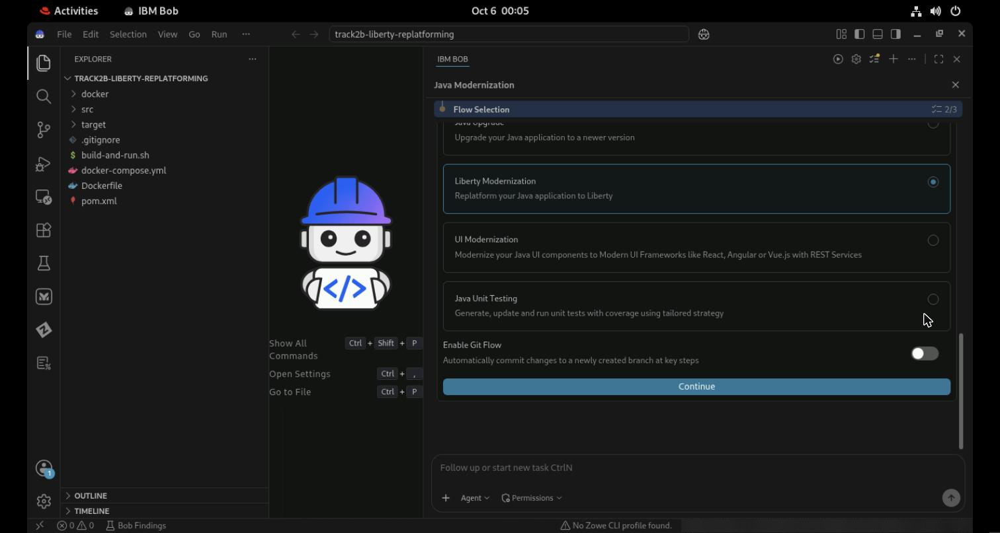
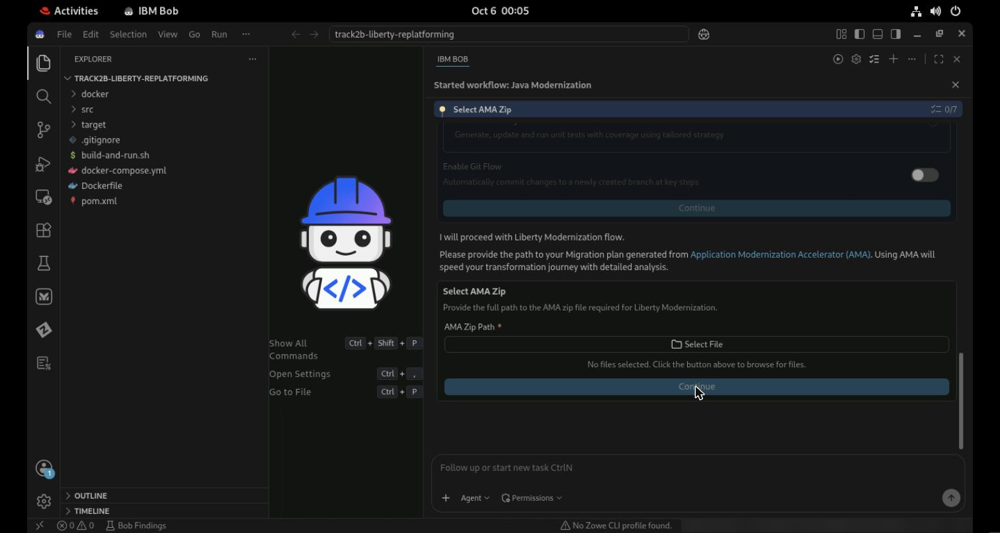
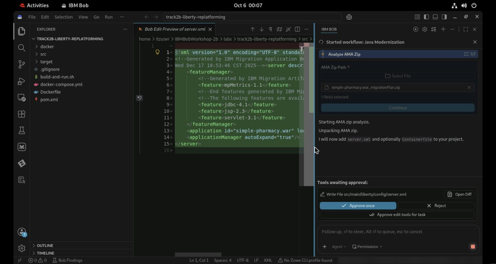
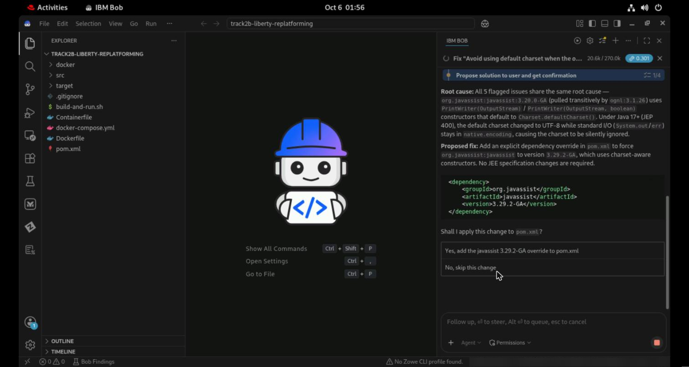
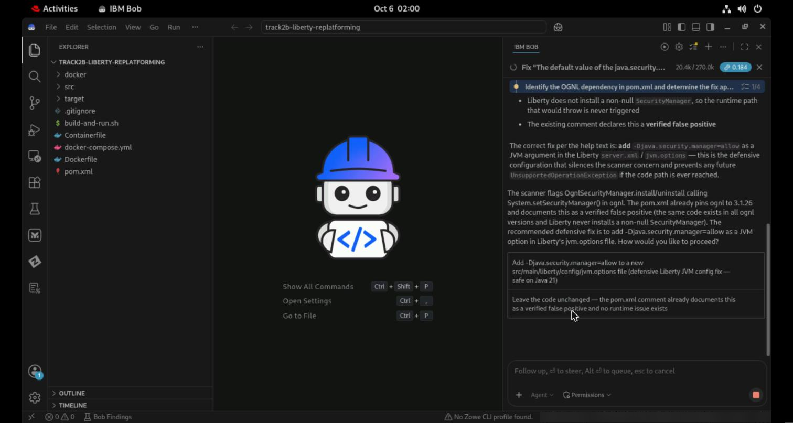
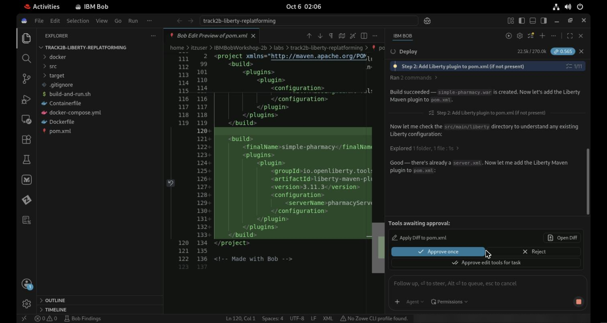
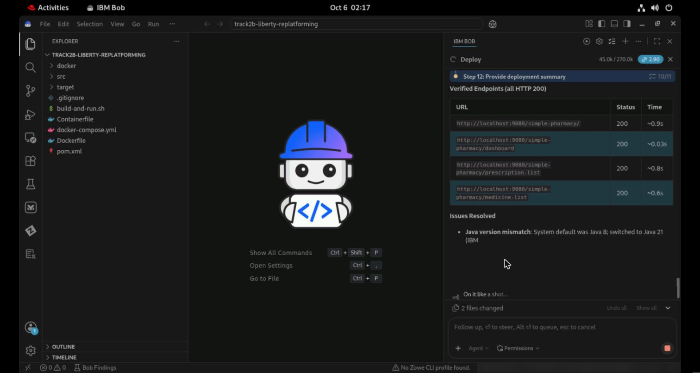
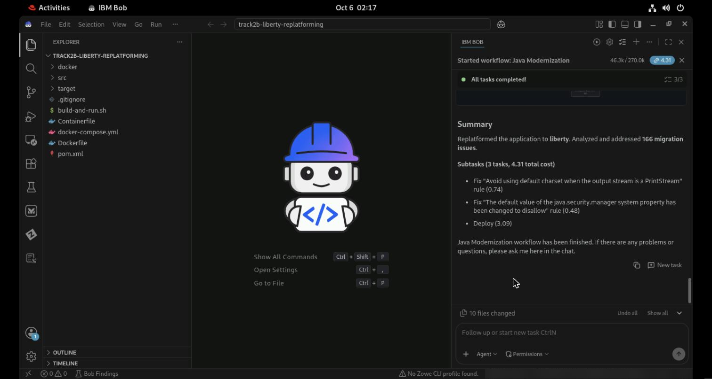
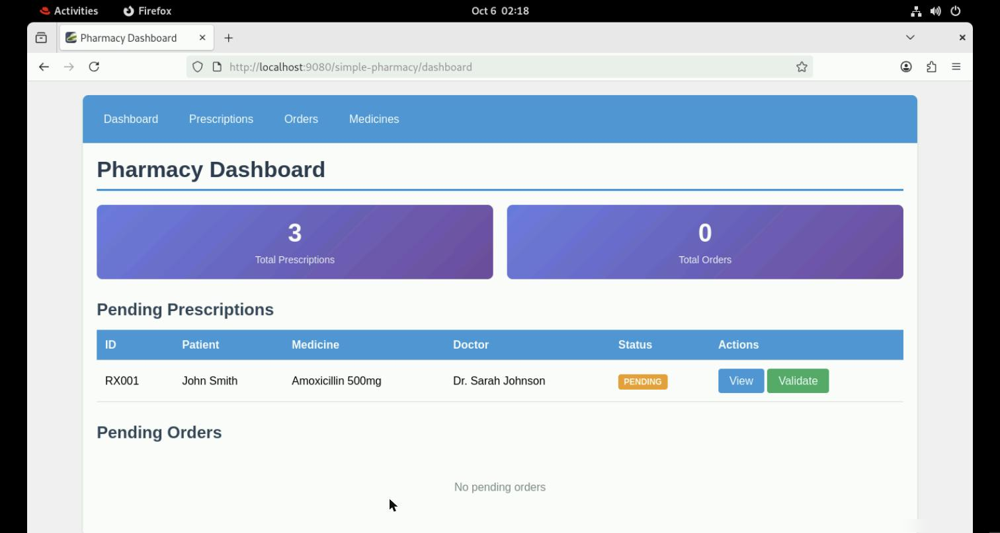

# IBM Bob — Liberty Replatforming Lab (Bonus 2b)
## Simple Pharmacy: WebSphere traditional → Liberty, driven by an AMA migration plan

<sub>⏱ About 60 minutes in total, including 15 minutes of setup · Bob tier: Premium Package for Java · Verified on IBM Bob 2.2.1 on the Red Hat 9.6 TechZone VM, 6 October 2026 · About 4–5 Bobcoins</sub>

A bonus track for anyone who finishes Track 2 early, or who cares more about *where* an application runs than *which Java* it runs on. It uses the same pharmacy application, in an earlier state: still deployed on WebSphere Application Server traditional.

---

## Table of Contents
1. [Introduction](#introduction)
2. [Set up your environment](#set-up-your-environment)
3. [What to watch for](#what-to-watch-for)
4. [Exercise 1: Run the Liberty Modernization workflow](#exercise-1-run-the-liberty-modernization-workflow)
5. [Exercise 2: See it running on Liberty](#exercise-2-see-it-running-on-liberty)
6. [Exercise 3: Read what changed](#exercise-3-read-what-changed)
7. [Troubleshooting](#troubleshooting)
8. [Conclusion](#conclusion)

---

# Introduction

### The application

The **Simple Pharmacy Management System** is a small Struts 2 web application — prescriptions, orders, medicines and a dashboard. In this lab it starts life packaged for **WebSphere Application Server traditional** (tWAS), the way many enterprise Java applications still are.

### Replatforming, and where AMA fits

Moving from tWAS to **Liberty** — IBM's lightweight, container-ready Java runtime — is usually the first step of modernizing a Java estate. The analysis for it is done by **IBM Application Modernization Accelerator (AMA)**: it scans the application and produces a *migration plan* — a ZIP containing the analysis reports, a generated Liberty `server.xml`, a `Containerfile`, Kubernetes manifests and the OpenRewrite recipes that apply the fixes.

The plan for this application is already generated and ships with the lab: `labs/track2b-migration-plan/simple-pharmacy.war_migrationPlan.zip`. Bob's **Liberty Modernization** workflow takes it from there.

| | Before | After |
|---|---|---|
| Runtime | WebSphere traditional | **Liberty** (`liberty-maven-plugin`) |
| Java | 8 | **21** — the AMA recipes move the compiler target |
| Liberty config | none | `server.xml` generated by AMA |
| Container | tWAS `Dockerfile` | AMA `Containerfile` (Semeru + Liberty images) |
| Dependency fixes | — | Javassist 3.29.2-GA override; one false positive documented |

### Learning objectives

By the end of this lab you will have:
- Used an **AMA migration plan** as the input to a Bob workflow
- Watched Bob turn 166 AMA findings into recipes, subtasks and a deployment
- Approved one fix, declined another as a false positive, and **rejected a bad diff**
- Seen the application running on Liberty, and read exactly what changed

---

# Set up your environment

<sub>⏱ About 15 minutes, at the start of the lab. Everyone on the TechZone image starts from the same clean VM — Bob and Firefox only — so everyone runs these steps. If you've just done Track 2 on this VM, steps 1 and 4 are already done: install Semeru 21 (end of step 1) and go to step 2.</sub>

Open a terminal (**Activities → Terminal**). On the TechZone VM, `itzuser` has passwordless `sudo`, and Bash 5, `zip`, `unzip`, `curl` and `git` are already there.

> Working in the browser (Guacamole): if a click doesn't register, click again. **Ctrl+C may not reach the VM** — use a second terminal tab (**Ctrl+Shift+T**) instead. Avoid **Super+Up** to maximize a terminal: it reaches the shell as an Up arrow and recalls the previous command.

### 1. SDKMAN, Java 8, Java 21 and Maven
<sub>⏱ About 3 minutes</sub>

```bash
curl -s "https://get.sdkman.io" | bash
source "$HOME/.sdkman/bin/sdkman-init.sh"

# Java 8 is where the application starts — make it the default
JAVA8=$(sdk list java | grep -o '8\.0\.[0-9]*[^ ]*-zulu' | grep -v fx | sort -V | tail -1)
sdk install java "$JAVA8"
sdk default java "$JAVA8"

# Java 21 (IBM Semeru) is where the AMA recipes take it — install it, but don't make it the default
JAVA21=$(sdk list java | grep -o '21\.[0-9.]*-sem' | sort -V | tail -1)
echo n | sdk install java "$JAVA21"

sdk install maven
```

> Why both? The workflow's first build runs on Java 8, like the original. Its recipes then move the compiler to Java 21, and from there Bob builds and deploys with the Semeru 21 it finds under `~/.sdkman/candidates/java/`. Without a Java 21 installed, the later steps have nothing to build with.

### 2. The lab code, with Maven's cache warmed
<sub>⏱ About 1 minute</sub>

```bash
git clone https://github.com/vandepol/IBMBobWorkshop ~/IBMBobWorkshop
cd ~/IBMBobWorkshop/labs/track2b-liberty-replatforming
mvn -B dependency:go-offline && mvn -B package && mvn -B clean
```

You should see `BUILD SUCCESS` and a `simple-pharmacy.war`. No Docker or WebSphere is needed — the original's `Dockerfile` and `build-and-run.sh` show how it ran on tWAS, but you won't run them.

### 3. Open the lab in Bob
<sub>⏱ About 3–5 minutes the first time</sub>

Start Bob from the terminal, so it picks up SDKMAN's Java and Maven:

```bash
bobide ~/IBMBobWorkshop/labs/track2b-liberty-replatforming
```

Open **this exact folder** — the one with `pom.xml` — not `labs/` or the repo root. The first time Bob starts on the VM, expect these prompts, in this order:

| Prompt | What to do |
|---|---|
| *Choose password for new keyring* | Pick a password you'll remember and click **Continue** |
| *Welcome to Bob — import your settings?* | **Skip for now** |
| *Restricted Mode is intended for safe code browsing* | Click **Manage → Trust**. Bob can't run builds in an untrusted folder |
| *Bob v1.0.0 chats were created in an older version* | **Skip migration** |
| *A git repository was found in the parent folders* | **Never** |
| **Log in to Bob** → *The extension wants to sign in* | **Allow**, sign in with your IBMid in Firefox |
| Firefox: *Allow this site to open the ibm-bob link?* | **Open Link** |
| Bob: *Allow 'IBM Bob' extension to open this URI?* | **Open** |
| *You are entitled to the Premium Package for Z* | **Cancel** — this lab doesn't need it |

> If you've done Track 3 on this VM, the Z package's welcome tabs and two Z notifications (*AZEEV0394E*, *CRRZG5168E*) open too. Close them; they don't affect this lab.

### 4. The right team, with the Java package installed
<sub>⏱ About 2 minutes</sub>

Open **Bob ⚙ → General**:
1. **Team** — pick the one your instructor gave you. Not every team includes the Java package.
2. **Add-ons** — **IBM Bob Premium Package for Java Modernization** must be listed. If it shows **Install**, click it, then **Trust Publisher & Install**.

The *IBM Bob Premium Package for Java* welcome page opens, with **Java Upgrade**, **Liberty Modernization** and **UI Modernization** cards. The ▶ button in the Bob panel appears once the package is installed.

> **Bob version.** This lab was verified on Bob 2.2.1. The TechZone image has shipped 2.1.0; to upgrade, follow *Set up the environment* in [Track 3](track3-z-bank-of-z.md).

---

# What to watch for

- **AMA as input.** Bob doesn't start from a blank page: it reads a migration plan produced by a dedicated analysis tool, and acts on it.
- **Recipes, then judgment.** 47 OpenRewrite recipes do the mechanical work; Bob runs a sub-agent only for the findings that need reasoning.
- **Not every finding is a fix.** One of the two critical findings is a false positive — and Bob reads a comment the team left in `pom.xml` to recognize it.
- **Bob makes a mistake.** During deployment it proposes an invalid `pom.xml`. Reading the diff before approving is the whole point of approvals.
- **Build-green, then run-green.** The workflow doesn't stop at a successful build: it deploys to Liberty, reads the logs, and checks every page over HTTP.

---

# Exercise 1: Run the Liberty Modernization workflow

<sub>⏱ About 25 minutes</sub>

> 💡 **Don't type in the Bob chat while the workflow runs.** A message goes to whichever agent is active — and if Bob is waiting on a question, your text becomes the answer.

### 1. Start the workflow

Click **▶** in the Bob panel toolbar (top right, left of the gear) → **Java Modernization** → **Start**. (The **Liberty Modernization → Start** card on the welcome page goes to the same place.)

### 2. Analyze the project

The **Select Project** field shows your folder: `/home/itzuser/IBMBobWorkshop/labs/track2b-liberty-replatforming`. Leave *Custom project path* and *Custom build command* off and click **Continue**.

Bob detects the dependencies and asks to **Query vulnerabilities** — a read-only lookup — then to run a baseline `mvn clean install`. **Approve once** for each. The baseline build passes on Java 8.

### 3. Choose Liberty Modernization



Select **Liberty Modernization** and switch **Enable Git Flow** off (manage branches yourself). Click **Continue**.

### 4. Hand Bob the AMA migration plan



Click **Select File**. In the file dialog, press **Ctrl+L** and type the full path:

```
/home/itzuser/IBMBobWorkshop/labs/track2b-migration-plan/simple-pharmacy.war_migrationPlan.zip
```

Press **Enter** (or **Select File**), then **Continue**.

> 🚩 Over Guacamole, the first characters you type into the file dialog can be lost while the location field opens. If **Select File** stays grey, press **Home** and check the path starts with `/home`.

Bob unpacks the plan and proposes two files from it — **Approve once** for each:
- **`src/main/liberty/config/server.xml`** — the Liberty server configuration AMA generated. Note the feature list: Liberty only loads what you ask for (`servlet-3.1`, `jsp-2.3`, `jdbc-4.1`, `mpMetrics-1.1`).
- **`Containerfile`** — a two-stage build on IBM Semeru and the WebSphere Liberty image, for when you containerize.



Bob may note *"The migration plan was generated by older AMA version — results may differ from latest AMA."* That's expected; the plan was generated in December 2025.

### 5. Run the OpenRewrite recipes

*AMA analysis complete. Found 15 flagged rules and 166 results.* Bob asks to **Run 47 recipes** (Java migration, Liberty and Spring recipe sets). **Approve once**. About ten files change.

### 6. Replatform Liberty issues — two subtasks

Bob runs one sub-agent per critical finding the recipes can't fix mechanically. Approve each **Execute subtask**, and **Approve todo tools for task** when its to-do list appears.

**Subtask 1 — "Avoid using default charset when the output stream is a PrintStream".** Bob checks the dependency tree before proposing anything, then explains the root cause and offers one fix:



Choose **Yes, add the javassist 3.29.2-GA override to pom.xml**, read the diff (one `<dependency>` block), and **Approve once**.

Bob then compiles to verify — and finds *"The active JDK is Java 8, but the project now targets Java 21."* The recipes moved the compiler target. Bob looks under `~/.sdkman/candidates/java/`, finds Semeru 21 and rebuilds with it. Approve those commands (they're read-only checks and builds). This repeats in each subtask; it's expected.

**Subtask 2 — "The default value of the java.security.manager system property has been changed to disallow".** Bob reads the comment already in `pom.xml` and agrees it's a **verified false positive**: Liberty never installs a SecurityManager, so the flagged OGNL code path can't throw.



Choose **Leave the code unchanged**. Not every finding needs a code change — and the subtask's completion note records *why*, which is what an auditor will ask.

### 7. Deploy

Bob summarizes the two subtasks and offers **Deploy & Validate**: build, deploy to a **local** Liberty server, read the logs, report issues — nothing goes to a remote environment. Click **Start local deployment**, then approve the *Deploy* subtask. It has 11 steps; for the repeated `mvn` and `liberty:` commands, **Approve for task** keeps it moving.

> 🚩 **Read this diff before you approve it.** To add the Liberty Maven plugin, Bob proposed a **second `<build>` element** after the existing one:
>
> 
>
> Maven rejects a POM with two `<build>` elements. Click **Reject**. Bob re-reads the file — *"I can't have two `<build>` sections in one POM"* — and proposes the plugin inside the existing `<plugins>` block. Approve that one.
>
> Your run may not make this mistake. If it does, a plain **Reject** is enough.

Bob then runs `liberty:create` (downloads Liberty), `liberty:install-feature`, `liberty:deploy` and `liberty:start`. The application starts in a few seconds. Bob reads `messages.log` — a Log4j2 *StatusLogger* line is the only "error", and it's harmless — and checks the pages with `curl`.

Liberty uses the WAR's name as the context root (`/simple-pharmacy.war/`), so Bob offers a cleaner one: it sets `context-root="/simple-pharmacy"` in `src/main/liberty/config/server.xml` and redeploys. Approve it.



When Bob asks **"Did the application start successfully…?"**, check it yourself first (Exercise 2), then answer **Yes, the application started successfully with no errors.**

### 8. Summary



*Replatformed the application to liberty. Analyzed and addressed 166 migration issues.* Three subtasks with their costs — about **4.3 Bobcoins** in the verification run (charset fix 0.74, false positive 0.48, deployment 3.09).

### ✋ Checkpoint — everyone has the summary on screen and Liberty running

---

# Exercise 2: See it running on Liberty

<sub>⏱ About 5 minutes</sub>

In Firefox on the VM:

| Page | URL |
|---|---|
| Dashboard | http://localhost:9080/simple-pharmacy/dashboard |
| Prescriptions | http://localhost:9080/simple-pharmacy/prescription-list |
| Orders | http://localhost:9080/simple-pharmacy/order-list |
| Medicines | http://localhost:9080/simple-pharmacy/medicine-list |



You should see **3 prescriptions, RX001 pending**. Click **View** on RX001: the details page passes `prescriptionId` through Struts and shows the patient, doctor and medicine.

> If Bob didn't change the context root in your run, use `/simple-pharmacy.war/` instead of `/simple-pharmacy/`.
>
> ℹ️ *Medicines → View* fails — `struts.xml` points at a `medicine-view.jsp` that was never written. It's a pre-existing bug, not something the replatform caused.

Stop the server when you're done — from the project folder:

```bash
mvn liberty:stop
```

---

# Exercise 3: Read what changed

<sub>⏱ About 10 minutes</sub>

Click **Show all** next to *files changed* at the bottom of the Bob panel, or in a terminal:

```bash
cd ~/IBMBobWorkshop/labs/track2b-liberty-replatforming
git status --short .
git diff --stat .
git diff pom.xml
```

In the verification run: **8 files changed, 33 insertions, 6 deletions**, plus the new `Containerfile` and `src/main/liberty/`.

- **`pom.xml`** — the Javassist 3.29.2-GA override with its reason; `maven-compiler-plugin` 3.8.1 → 3.16.0 with `<release>21</release>` (was `1.8`); `maven-war-plugin` 3.3.1 → 3.5.1; `liberty-maven-plugin` 3.11.3 with server `pharmacyServer`
- **7 Java classes** — `@Serial` on each `serialVersionUID` (a Java 14 feature: the recipes moved the code to Java 21 idioms too)
- **`src/main/liberty/config/server.xml`** — AMA's feature list and the application, with `context-root="/simple-pharmacy"`
- **`Containerfile`** — AMA's container build, unchanged

Discuss before moving on:
- AMA generated the plan; Bob applied it, made judgment calls and deployed. Which of those steps would you still want a person to own?
- The workflow also moved the application to Java 21. Was that what you expected from "replatform"? Where would you have wanted to be asked?
- Bob proposed an invalid `pom.xml` and fixed it when rejected. What does that say about *how* to approve, not just *whether*?

---

# Troubleshooting

| Symptom | What to do |
|---|---|
| No **Java Modernization** in the workflow list | Bob ⚙ → General: pick the right **Team** and **Install** the Premium Package for Java Modernization. Check you opened `labs/track2b-liberty-replatforming` itself |
| No ▶ button in the Bob panel | The Java package isn't installed (setup step 4) |
| Bob's agents don't run commands | The folder is in **Restricted Mode**: **Manage → Trust** |
| **Select File** stays grey after typing the AMA path | Characters were lost — press **Home** and fix the start of the path |
| *The active JDK is Java 8, but the project targets Java 21* | Expected after the recipes. Bob finds Semeru 21 itself if it's installed (setup step 1). If it isn't: `sdk install java <21.x-sem>` in a terminal, then tell Bob it's there |
| `sdk use …` fails in Bob with exit code 127 | `sdk` is a shell function Bob's command shell doesn't load; Bob falls back to setting `JAVA_HOME` and `PATH`. Nothing to do |
| `mvn` fails with *Duplicated tag: 'build'* | You approved the second `<build>` element. Ask Bob: *"pom.xml has two build elements; move the Liberty plugin into the existing plugins block."* |
| Pages return 404 at `/simple-pharmacy/` | The context root is still the WAR name: use `/simple-pharmacy.war/` |
| Port 9080 already in use | `mvn liberty:stop` in this folder. Track 2's server uses 9081 and doesn't conflict |
| *Medicines → View* fails | Pre-existing bug (no `medicine-view.jsp`) |
| A *Log4j2 StatusLogger* "ERROR" in `messages.log` | Harmless: Struts falls back to its own logging |
| `SRVE0321E: The [struts2] filter did not load` | Didn't occur on the TechZone run. If you see it with pages still working, it's a class-loading side effect; if pages return 500, ask Bob to investigate from the log |
| `CWWKS9660E: The orb element … requires a user registry` | Safe to ignore — the app doesn't use ORB-based EJBs |
| *Unable to access jarfile …/bob-code/assets/jars/ta-jam-*.jar* (Mac) | Run Bob from `/Applications`, not the mounted `.dmg`. Ask your instructor for the jars bundle if it persists |
| Agent steps finish instantly with *Request Failed*, Usage stays 0 | Bob's session is stale: sign out and back in |
| *Command cancelled* | Something was typed in chat while a command awaited approval. Ask Bob to continue |

---

# Conclusion

You have:
- ✅ Fed an AMA migration plan into Bob's Liberty Modernization workflow
- ✅ Seen 166 findings become 47 recipes, two reasoned subtasks and a deployment
- ✅ Approved a diagnosed fix, documented a false positive, and rejected a bad diff
- ✅ Run the pharmacy on Liberty and read every change

The application is now on Liberty and Java 21 — but still on Struts 2.5 and Java EE 7 APIs. [Track 2](track2-java-upgrade.md) picks up from there: Jakarta EE 10, Struts 7, and what it takes to make a green build actually run.
