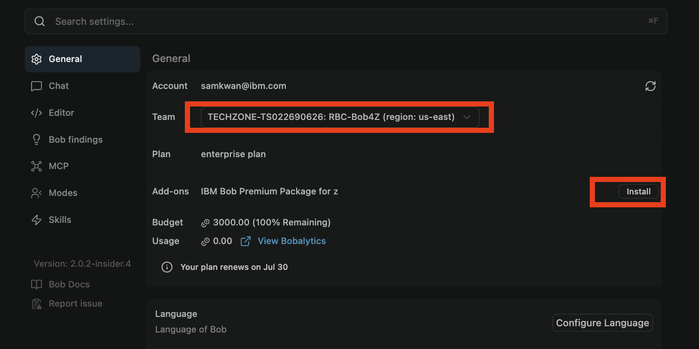
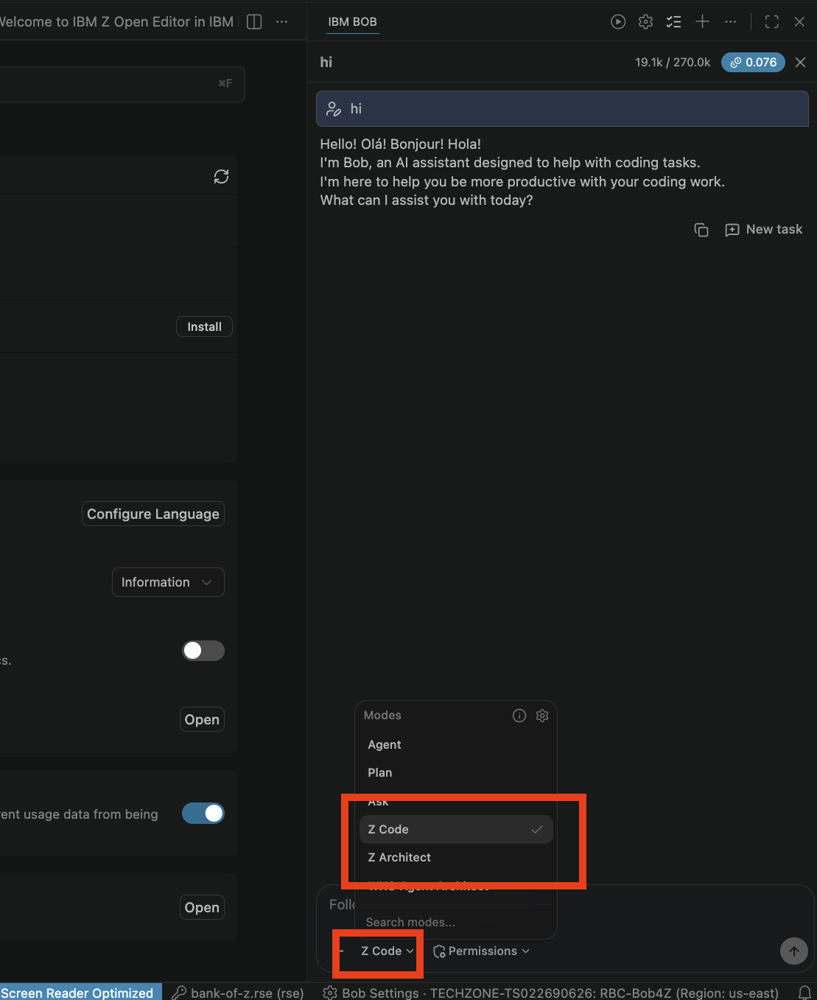
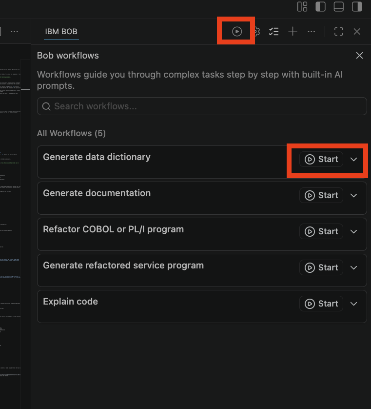

# IBM Bob for Z — 1-Hour Workshop

**Total time:** about 75 minutes — the first 15 set up the environment  
**Environment:** the IBM TechZone Red Hat Enterprise Linux 9 VM, in your browser, or your own laptop with IBM Bob  
**Sample workspace:** [Bank of Z](https://github.com/IBM/Bank-of-Z) — you clone it in the first step  
**Tested on:** IBM Bob 2.2.1, Red Hat Enterprise Linux 9.6 (TechZone VM), 5 October 2026

---

## 0:00–0:15 · Set up the environment

Everyone on the TechZone image starts from the same clean VM, so everyone runs these steps. Open a terminal (**Activities → Terminal**). `itzuser` has passwordless `sudo`.

> Working in the browser: if a click doesn't register, click again. Firefox asks for confirmation on **Ctrl+Q**; press **Enter**.

### 1. Clone Bank of Z
<sub>⏱ Under a minute</sub>

```bash
git clone https://github.com/IBM/Bank-of-Z ~/Bank-of-Z
```

### 2. Make sure Bob is 2.2.0 or newer
<sub>⏱ About 3 minutes if you need to upgrade</sub>

The **Premium Package for Z requires IBM Bob 2.2.0 or newer.** On an older Bob it installs, then reports *"Install or upgrade to IBM Bob version 2.2.0 or newer"*, its supporting extensions fail to install, and the **Z Code** and **Z Architect** modes never appear. The TechZone image has shipped Bob 2.1.0. Check with:

```bash
rpm -q bobide
```

If it's older than 2.2.0, upgrade:

1. Quit Bob if it's running (**Ctrl+Q**).
2. Click **Update** in Bob's title bar — or open **https://bob.ibm.com/download** in Firefox — and download **Linux RPM x64**. It saves to `~/Downloads`.
3. Install it:

   ```bash
   sudo dnf install -y --nogpgcheck ~/Downloads/IBM-Bob-linux-x64-*.rpm
   rpm -q bobide          # bobide-2.2.1 or newer
   ```

   The RPM isn't signed (neither is the one on the image), so `dnf` needs `--nogpgcheck` for this one file — otherwise it stops with *"GPG check FAILED"*.

On a Mac or Windows laptop: Bob ⚙ shows the version at the bottom of its settings list; update from **bob.ibm.com/download** if it's below 2.2.0.

### 3. Open Bank of Z in Bob
<sub>⏱ About 3–5 minutes the first time</sub>

```bash
bobide ~/Bank-of-Z
```

The first time Bob starts on the VM, expect these prompts, in this order:

| Prompt | What to do |
|---|---|
| *Choose password for new keyring* | Pick a password you'll remember and click **Continue**. Bob keeps your sign-in there; don't cancel |
| *Welcome to Bob — import your settings?* | **Skip for now** |
| *Restricted Mode is intended for safe code browsing* | **Manage → Trust** |
| *Bob v1.0.0 chats were created in an older version* | **Skip migration** |
| **Log in to Bob** → *The extension wants to sign in* | **Allow**, then sign in with your IBMid in Firefox |
| Firefox: *Allow this site to open the ibm-bob link?* | **Open Link** |
| Bob: *Allow 'IBM Bob' extension to open this URI?* | **Open** |

### 4. Install the Premium Package for Z
<sub>⏱ About 2 minutes</sub>

Open **Bob ⚙ → General** and check:
1. **Team** — if your account belongs to several teams, pick the one your instructor gave you. Not every team includes the Z package.
2. **Add-ons** — next to **IBM Bob Premium Package for Z**, click **Install** (if asked, **Trust Publisher & Install**). Bob may also offer it in a notification: *"You are entitled to the Premium Package for Z — Install"*.



Bob opens *Welcome to IBM Z Open Editor* and *Welcome to IBM Bob Premium Package for Z* tabs when it's done.

### 5. Setup check
<sub>⏱ About 1 minute</sub>

Click the mode selector at the bottom of the Bob chat panel. **Z Code** and **Z Architect** must be in the list.



> **Expected messages you can ignore.** There's no mainframe connection in this workshop — all analysis is local. So you'll see:
> - *AZEEV0394E The Bob integration was skipped because the Z Open Debug profile could not connect to the host* and *EQAVS2060E Unable to log in. zOpenDebug profile bank-of-z…* — close them.
> - A box at the top of the window asking you to *Enter the user name for the rse profile bank-of-z.rse* — **press Escape**, every time it appears (it can come back when Bob opens COBOL files). Don't enter credentials.
> - The Problems count in the status bar climbing into the hundreds while Bob scans: copybooks it can't fetch from a host. Not your concern for this lab.
>
> **Starting a new task:** when you click **+** (New Task), Bob may ask which workspace to use and list the remote z/OS profiles from Bank of Z's Zowe configuration. Choose **New task in Bank-of-Z** — the local folder.

> If you hit any other issue, flag an IBM team member now.

---

## Exercise 1: Workspace Initialization & Data Dictionary

**Mode:** Z Code

### Exercise 1.1: Generate the AGENTS.md File

1. Open **IBM Bob Chat** and switch to **Z Code mode**.
2. Run:
   ```
   /init
   ```
3. Bob scans the workspace, detects languages and copybook paths, and creates `AGENTS.md` in the workspace root.
4. Open `AGENTS.md` and verify it was created.

> ⚠️ Z Understand server is not set up for this workshop — local analysis only.

---

> 🆕 **New Task:** Create a new task in IBM Bob before Exercise 1.2.

### Exercise 1.2: Build a Data Dictionary

**Option A — Chat prompt:**
```
Create a data dictionary for INQACC.cbl
```

**Option B — Workflow button:**
1. Click the **▶** (play) button at the top of the Bob panel to open **Bob workflows**, and choose the local **Bank-of-Z** workspace.
2. Click **Start** on **Generate data dictionary**.
3. In its *Prepare* step, click **Browse files** and pick up to 10 programs (for example `src/base/cics/cobol/INQACC.cbl`), then **Continue with selection**.



The first time, Bob says no program database exists yet and offers to run `scan_program` on the COBOL folder — choose **Yes**. Bob then drafts the entries (15 for INQACC in our run, each with a short and a long description) and opens them as a diff so you can edit them; click **I'm done editing** to save. The dictionary is saved to `bobz/DD.json` in the workspace, and Bob records its location in `AGENTS.md`, so it's used in later interactions.

**More prompts:**
```
Add variables from CREACC.cbl to the data dictionary
```
```
Which programs use the variable HV-ACCOUNT-ACC-NO?
```

---

## Exercise 2: Impact Analysis & Call Chain Tracing

**Mode:** Z Architect

### Exercise 2.1: Generate an Impact Analysis

1. Switch to **Z Architect mode**.
2. Request an impact analysis:
   ```
   Analyze the impact of adding a new ACCOUNT-CREDIT-LIMIT field to the ACCOUNT.cpy copybook
   ```
3. Bob uses the program database from Exercise 1, finds every program that includes the copybook, and follows the change through COMMAREA copybooks, the `ACCDB2.cpy` DB2 host variables and the z/OS Connect API mappings. Before rating the risk it asks clarifying questions — the new field's COBOL type, whether the DB2 `ACCOUNT` table needs an `ALTER`, and whether the COMMAREA contracts should carry it. Answer them the way your design would. The report is saved to `bobz/impact-analysis/<change-name>/IMPACT-ANALYSIS.md`.
4. Open and review `IMPACT-ANALYSIS.md` — it includes mermaid dependency diagrams, risk ratings, and a testing plan.

**More prompts:**
```
What will be affected if I modify the SORTCODE.cpy copybook?
```
```
Create an implementation plan for adding overdraft alert notifications to INQACC.cbl
```

---

> 🆕 **New Task:** Create a new task in IBM Bob before Exercise 2.2.

### Exercise 2.2: Cross-Program Call Chain Tracing

1. Still in **Z Architect mode**, ask:
   ```
   Which program in this repo calls XFRFUN, and how does the data get passed between them?
   ```
2. Bob identifies the caller, maps the COMMAREA layout, and traces the full chain without you opening a single file.

**More prompts:**
```
What programs does DBCRFUN call or link to?
```
```
Show me the full call chain from BNKMENU down to the DB2 account update
```

---

## Exercise 3: Code Understanding & Documentation

**Mode:** Z Code

### Exercise 3.1: Generate a Code Explanation

**Option A — Chat prompt:**
```
Explain what @INQACC.cbl does
```
```
Explain @DBCRFUN.cbl in simple terms for a new developer
```

**Option B — Ask for a perspective:**
```
Explain @INQACC.cbl from a business perspective
```
Try **architect** or **developer** as well. (On Bob 2.2.1 the ▶ **Bob workflows** list has no separate "Explain code" workflow; use the chat prompt.)

Bob resolves all copybooks automatically and references the data dictionary for variable context.

---

> 🆕 **New Task:** Create a new task in IBM Bob before Exercise 3.2.

### Exercise 3.2: Generate Program Documentation

**Option A — Chat prompt:**
```
Generate documentation for @XFRFUN.cbl
```

Type `@` and pick the file from the list (choose the one under `src/base/cics/cobol`, not the expanded copy under `.bobz`). Bob may offer to add data dictionary entries first, then hand off to the **Generate program documentation** workflow: click **Start workflow**, **Browse files**, and pick the program — type the full path, for example `/home/itzuser/Bank-of-Z/src/base/cics/cobol/XFRFUN.cbl` (the file dialog doesn't expand `~`). Bob writes the sections in parallel and saves the result under `docs/program/`, mirroring the source path — for example `docs/program/src/base/cics/cobol/XFRFUN.md`.

**Option B — Workflow button:**
1. Click **▶** → **Generate program documentation** → **Start**.
2. **Browse files** to choose the program(s), then **Continue with selection**.

**More prompts:**
```
Create comprehensive documentation for @DBCRFUN.cbl
```
```
Document all CICS COBOL programs in src/base/cics/cobol/
```

---

## Exercise 4: Code Generation

**Mode:** Z Code

### Exercise 4.1: Generate a New COBOL Program

1. Switch to **Z Code mode**.
2. Describe the requirement:
   ```
   Generate a COBOL CICS program that validates a customer credit score against the DB2 CUSTOMER table and returns eligibility status
   ```
3. Bob reads an existing CICS/DB2 program (`INQCUST.cbl`) for the house conventions, writes a COMMAREA copybook and the new program, then runs the COBOL editor's diagnostics on its own output and fixes what they find. Expect SQLCODE checks after every `EXEC SQL`, the shared abend handling, 4-character abend codes and 88-level condition names.
4. Click **Show all** to review both files, then keep them or **Undo all**. One remaining *Unused variable* warning on `ABEND-HANDLING SECTION` is a known Z Open Editor false positive that every CICS program in the repo shares.

**More prompts:**
```
Generate a new CICS COBOL program that retrieves customer details from the DB2 CUSTOMER table
```
```
Add a new paragraph to @INQACC.cbl that sends an IBM MQ message when the available balance drops below the overdraft limit
```
```
Update @XFRFUN.cbl to handle zero-amount transfer attempts with a CICS ABEND
```

---

## 🎉 Workshop Complete!

| Exercise | Capability |
|----------|-----------|
| Exercise 1 | Workspace initialization, AGENTS.md, data dictionary |
| Exercise 2 | Impact analysis, call chain tracing |
| Exercise 3 | Code explanation, program documentation |
| Exercise 4 | COBOL code generation |

**IBM Bob Documentation:** https://bob.ibm.com/docs/ide

> **Bobcoins.** On the TechZone run the four exercises used roughly 30 Bobcoins: `/init` ~4, data dictionary ~2, impact analysis ~9, call chain ~3, explanation and documentation ~8, code generation ~6. The impact analysis is the heaviest — run it once per table.

---

## Appendix: Optional Deep Dives

Explore these after the session at your own pace.

---

### Appendix A: Honest Gap Handling

In **Z Architect mode**, ask:
```
CRDTAGY1.cbl calls external credit agency programs via the CICS Async API. Are those programs available in this repository?
```
Bob states clearly when a program is not in the repository — it does not fabricate behaviour.

---

### Appendix B: End-to-End Data Lineage

In **Z Architect mode**, ask:
```
Trace ACCOUNT_ACTUAL_BALANCE from the DB2 table definition through every program that reads or updates it.
```

---

### Appendix C: COMP and COMP-3 Storage

In **Z Code mode**, open `INQACC.cbl` and ask:
```
In INQACC.cbl, explain HV-ACCOUNT-AVAIL-BAL, HV-ACCOUNT-ACTUAL-BAL, and HV-ACCOUNT-OVERDRAFT-LIM. How are they stored in memory and why were these types chosen for a banking app?
```

---

### Appendix D: REDEFINES Clause

In **Z Code mode**, ask:
```
In ACCOUNT.cpy, explain the REDEFINES on ACCOUNT-OPENED. How does it work and when would each view be used?
```

---

### Appendix E: CICS and MQ Transaction Flow

In **Z Code mode**, ask:
```
Walk me through what DBCRFUN does when a teller processes a cash deposit — from receiving the COMMAREA to updating the database.
```

---

### Appendix F: Modifying Existing Code

In **Z Code mode**, open the target file and ask:
```
Modify @INQACC.cbl to return the ACCOUNT-OVERDRAFT-LIMIT in addition to the balance fields
```
```
Add PROCTRAN audit logging to @DBCRFUN.cbl for all debit/credit transactions
```

---

*IBM Bob for Z Workshop — Bank of Z sample application*
