# IBM Bob — Java Upgrade Lab
## Simple Pharmacy: Java 8 → Java 21 and Jakarta EE 10, running on Liberty

<sub>⏱ About 90 minutes in total · Bob tier: Premium Package for Java · Verified on IBM Bob 2.2.1, 2 October 2026</sub>

---

## Table of Contents
1. [Introduction](#introduction)
2. [Prerequisites](#prerequisites)
3. [What to watch for](#what-to-watch-for)
4. [The Java Modernization workflow](#the-java-modernization-workflow)
5. [Setting up](#setting-up)
6. [Exercise 1: Run the Java Upgrade workflow](#exercise-1-run-the-java-upgrade-workflow)
7. [Exercise 2: Read what changed](#exercise-2-read-what-changed)
8. [Exercise 3: Run the upgraded application](#exercise-3-run-the-upgraded-application)
9. [Troubleshooting](#troubleshooting)
10. [Conclusion](#conclusion)

---

# Introduction

### The application

The **Simple Pharmacy Management System** is a small Struts web application that manages:
- **Prescriptions** — create and validate patient prescriptions
- **Orders** — process medication orders and payments
- **Medicines** — the medicine inventory
- **Dashboard** — pending prescriptions and orders at a glance

### What a Java upgrade involves

Moving an application from Java 8 to a current LTS release is rarely just a compiler flag. It usually means:
- **Namespace changes** — `javax.*` (Java EE) becomes `jakarta.*` (Jakarta EE)
- **Dependency upgrades** — libraries that pin old Java versions, or carry known vulnerabilities
- **Build and configuration updates** — compiler settings, plugin versions, deployment descriptors
- **Framework migrations** — frameworks that changed their own APIs to support Jakarta EE

## About this lab

You will use **Bob's Java Modernization workflow** (Java Upgrade) to move the pharmacy app to Java 21 and Jakarta EE 10, then use Bob's chat to finish the job and get the application running on Liberty.

| | Before | After |
|---|---|---|
| Java | 8 | **21** (IBM Semeru) |
| Enterprise APIs | Java EE 7 (`javax.*`) | **Jakarta EE 10** (`jakarta.*`) |
| Struts | 2.5.33 | **7.x** |
| Liberty features | `servlet-3.1`, `jsp-2.3` | **`servlet-6.0`, `pages-3.1`** |
| Known vulnerabilities | 10 | **0** |

## Learning objectives

By the end of this lab you will have:
- Run a structured, phased modernization workflow — **Analyze → Upgrade → Validate** — not a chat prompt
- Approved dependency fixes after reading Bob's root-cause analysis and the exact diff
- Seen a version upgrade turn into a vulnerability remediation, with advisory IDs
- Read Bob's per-task cost breakdown
- Seen the original application running on Java 8, and the upgraded one running on Java 21
- Watched Bob diagnose a failing deployment from a one-line request, and understood why *builds* and *runs* are two different milestones

---

# Prerequisites

<sub>⏱ About 15 minutes — do this before the session. On the sandbox VM it has already been done.</sub>

### 1. IBM Bob
- IBM Bob IDE installed and signed in
- A Bob team that includes the **Premium Package for Java** (Bob ⚙ → *General* lists it under *Add-ons*)

### 2. A modern Bash (macOS only)

SDKMAN's installer needs **Bash 4 or newer**; macOS ships Bash 3.2. Without this step the install stops with *"SDKMAN requires Bash 4 or higher"*, and Bob's own **Install SDKMan** button fails the same way.

```bash
brew install bash        # needs Homebrew (admin rights); on a locked-down laptop use the sandbox VM
bash --version           # should report 5.x — open a new terminal first
```

### 3. SDKMAN, Java 8 and Maven

SDKMAN is **required**: the workflow checks for it before it will continue (Windows uses WinGet instead).

```bash
curl -s "https://get.sdkman.io" | bash
source "$HOME/.sdkman/bin/sdkman-init.sh"

# Newest Zulu 8 build — pinned identifiers like 8.0.492-zulu get withdrawn over time
JAVA8=$(sdk list java | grep -o '8\.0\.[0-9]*[^ ]*-zulu' | grep -v fx | sort -V | tail -1)
sdk install java "$JAVA8"
sdk default java "$JAVA8"    # 'default', not 'use': Bob runs builds in its own shell
sdk install maven
```

Don't install Java 21 yourself — Bob offers to install it during the lab. (If a Java 21 is already installed, Bob uses it and skips that step; the lab still works.)

### 4. The lab code, with Maven's cache warmed

```bash
git clone https://github.com/vandepol/IBMBobWorkshop
cd IBMBobWorkshop/labs/track2-java-modernization/Bobathon/labs/lab2-java-upgrade/snapB-java-upgrade
mvn -B dependency:go-offline && mvn -B clean
```

### 5. Restart Bob

Fully quit and reopen Bob so it picks up SDKMAN, Java and Maven.

> No Docker is needed. Liberty is downloaded by the Liberty Maven plugin the first time you run the app.

---

# What to watch for

- **Bob installs the JDK itself** when Java 21 is missing — environment management, not just code changes.
- **OpenRewrite recipes** applied across the codebase: `javax` → `jakarta`, compiler settings, plugins.
- **A diagnosed dependency fix** — root cause, a named fix, and a diff, waiting for your approval.
- **A vulnerability scan mid-migration**, and a remediation that lists every advisory it closed.
- **A per-task cost breakdown** in the final summary.

---

# The Java Modernization workflow

* **Analyze** — Bob inspects the project, checks dependencies for known vulnerabilities and runs a baseline build
* **Upgrade** — Bob applies OpenRewrite recipes, then works through build issues and vulnerabilities with your approval
* **Validate** — Bob rebuilds, cross-checks every fix and produces a visual summary with costs

## Approvals

Bob asks before it runs commands or edits files:
- **Approve once** — this action only
- **Approve for task** — this command for the rest of the task
- **Approve subtask tools for task / Approve edit tools for task** — a sub-agent's tools or edits for the rest of the task
- Shell commands may carry a **Security warning**: tick **I understand the risk**, then **Approve**

> 💡 **Don't type in the chat while the workflow is running.** A message is sent to whichever sub-agent is active and cancels any command that is waiting for approval.

---

# Setting up

<sub>⏱ About 5 minutes</sub>

### 1. Smoke test

```bash
java -version    # 1.8.0_xxx — Java 8 is the starting point
mvn -version     # 3.6+, and its "Java version" line should also say 1.8
sdk version      # SDKMAN must be present
```

### 2. Open the snapshot folder as the project root

In Bob: **File → Open Folder** → `snapB-java-upgrade`

```
IBMBobWorkshop/labs/track2-java-modernization/Bobathon/labs/lab2-java-upgrade/snapB-java-upgrade
```

> 🚩 Open **`snapB-java-upgrade`**, not the parent `lab2-java-upgrade`. The workflow only appears at the snapshot level.

You may see a few first-run pop-ups — *Install GitHub Copilot modernization extension*, *C++ IntelliSense*, *open the parent git repository*. They aren't part of the lab: choose **Not Now** / **Never**.

### 3. Confirm the workflow is available

Click the **▶** (play) button in the Bob panel's toolbar, top right — the first icon, left of the gear:

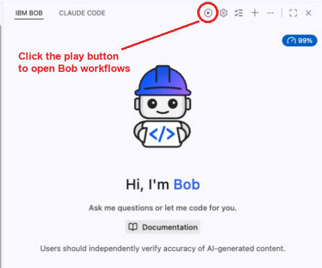

If Bob asks which workspace to use, pick **snapB-java-upgrade**. **Java Modernization** should be in the list.

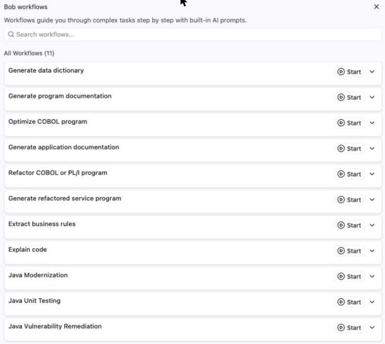

> 🚩 **No Java Modernization?** Your Bob team doesn't include the Premium Package for Java.

### 4. See the original application running on Java 8
<sub>⏱ About 5 minutes (the first run downloads Liberty)</sub>

Before changing anything, see what you're modernizing. In a terminal, from the `snapB-java-upgrade` folder:

```bash
java -version     # 1.8.0_xxx
mvn -version      # its "Java version" line must also say 1.8
mvn liberty:run
```

Wait for `CWWKZ0001I: Application simple-pharmacy.war started`, then open:

| Page | URL |
|---|---|
| Dashboard | http://localhost:9081/simple-pharmacy.war/dashboard |
| Prescriptions | http://localhost:9081/simple-pharmacy.war/prescription-list |
| Orders | http://localhost:9081/simple-pharmacy.war/order-list |
| Medicines | http://localhost:9081/simple-pharmacy.war/medicine-list |

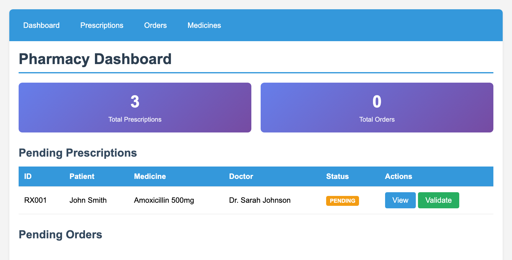

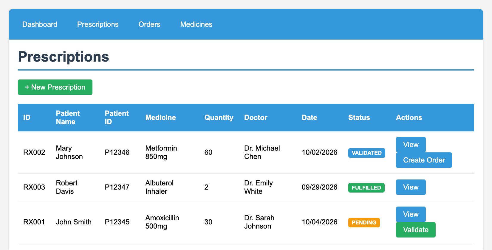

Note what you see — **3 prescriptions, RX001 pending**, and its *View* and *Validate* buttons. You'll compare against this in Exercise 3.

Stop the server with **Ctrl+C**, then run `./stop-liberty.sh` to make sure port 9081 is free.

> ⚠️ **Run this step on Java 8.** If `mvn -version` reports a much newer Java (Homebrew's Maven brings its own JDK, Java 24 or later), Struts 2.5's bytecode scanner fails at startup with an ASM error. Point Maven at Java 8 with `export JAVA_HOME="$(sdk home java "$JAVA8")"`, or use SDKMAN's Maven.
>
> ℹ️ *Medicines → View* fails in the original application too: `struts.xml` points at a `medicine-view.jsp` that was never written. It's a pre-existing bug, not something the upgrade causes.

---

# Exercise 1: Run the Java Upgrade workflow

### 1. Start the workflow
<sub>⏱ About 1 minute</sub>

Click the **▶** (play) button in the Bob panel's toolbar, top right — the first icon, left of the gear — to open the **Bob workflows** list:


If Bob asks which workspace to use, pick **snapB-java-upgrade**. Don't use the *Start* buttons on the *Welcome* page in the editor area — use the workflows list.

Find the **Java Modernization** row and click its **Start** button on the right:

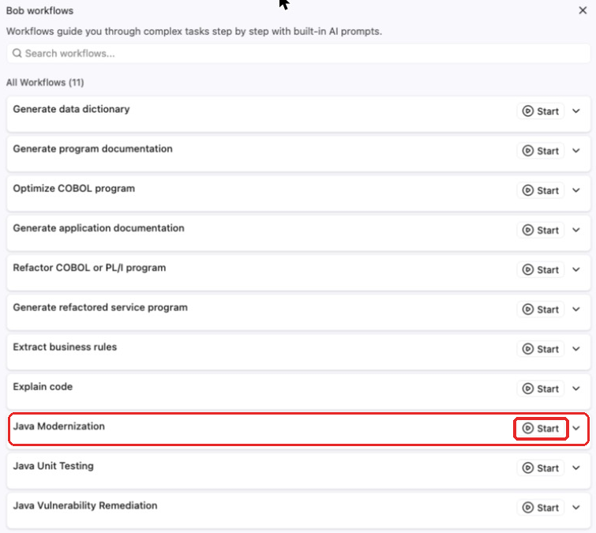

The workflow opens on a short *Getting Started* card — worth ten seconds.

### 2. Analyze the project
<sub>⏱ About 3 minutes</sub>

- **Select Project** already points at `snapB-java-upgrade`
- Leave **Custom project path** and **Custom build command** off
- Click **Continue**

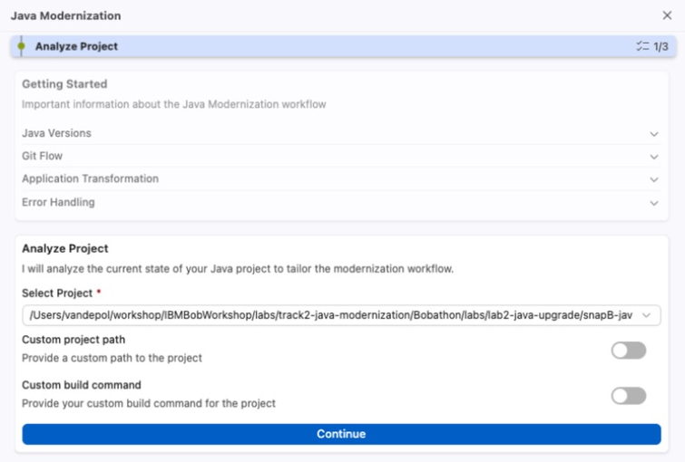

Bob detects the dependencies and asks to **query vulnerabilities** — approve it. It finds about ten, mostly in Struts 2 and Apache Commons. Then it asks to run a **baseline build** (`mvn clean install`) — approve that too. Bob proves the application compiles *before* anything changes, so nobody argues later about whether it was already broken.

While it builds, open `pom.xml` and find the `maven-compiler-plugin`: `<source>1.8</source>` and `<target>1.8</target>`.

### 3. Choose the modernization type
<sub>⏱ About 1 minute</sub>

- Select **Java Upgrade**
- Switch **Enable Git Flow** **off** — it is on by default, and branch management is outside this lab
- Click **Continue**

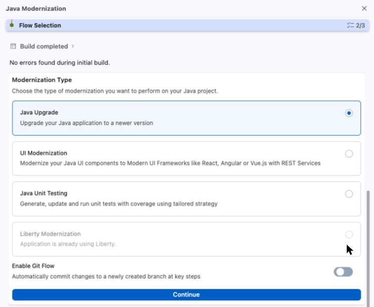

*Liberty Modernization* is greyed out ("Application is already using Liberty"); *UI Modernization* and *Java Unit Testing* are other labs in this repo.

### 4. Prerequisite check
<sub>⏱ About 1 minute (longer if SDKMAN needs installing)</sub>

The workflow expands to 14 steps and first checks for SDKMAN. Approve the `sdk version` command. If SDKMAN is missing, Bob offers **Install SDKMan**. On a Mac that only works once a modern Bash is installed:

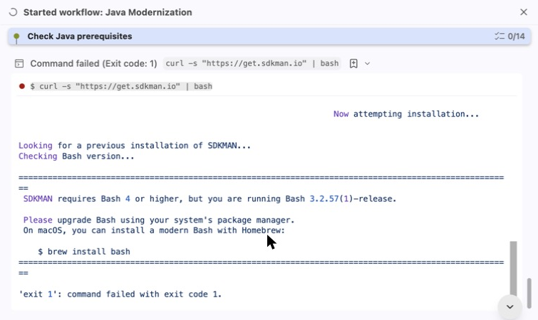

Run `brew install bash` in a terminal, then click **Retry**.

### 5. Configure the upgrade
<sub>⏱ About 2 minutes</sub>

| Setting | Value |
|---|---|
| Java Distribution | **Semeru (IBM)** (preselected) |
| Java Version | **Java 21** |
| Jakarta EE Version | **Jakarta EE 10** |

Bob describes the upgrade path, rates its complexity and estimates how many vulnerabilities the upgrade can resolve. Read it — you'll come back to it in Exercise 3. Click **Continue**.

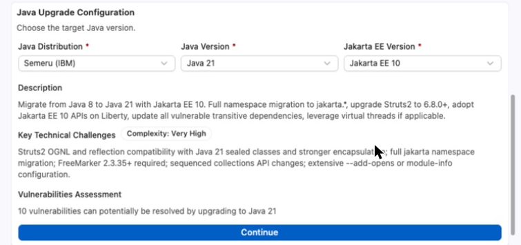

> If Java 21 isn't installed, Bob offers **Install** and sets it up through SDKMAN, then resumes. If it's already installed, Bob goes straight on.

### 6. Run the recipes
<sub>⏱ About 2 minutes</sub>

Bob proposes two OpenRewrite recipes — `UpgradeToJava21` and `JakartaEE10`. **Approve once.** In about a minute nine files change:
- `pom.xml` — `javax.servlet`/`javax.servlet.jsp` APIs become `jakarta.*`, the compiler moves to `<release>21</release>`, plugins are upgraded
- `web.xml` — moves to the Jakarta EE namespace, version 6.0
- seven Java classes — `@Serial` added to `serialVersionUID`

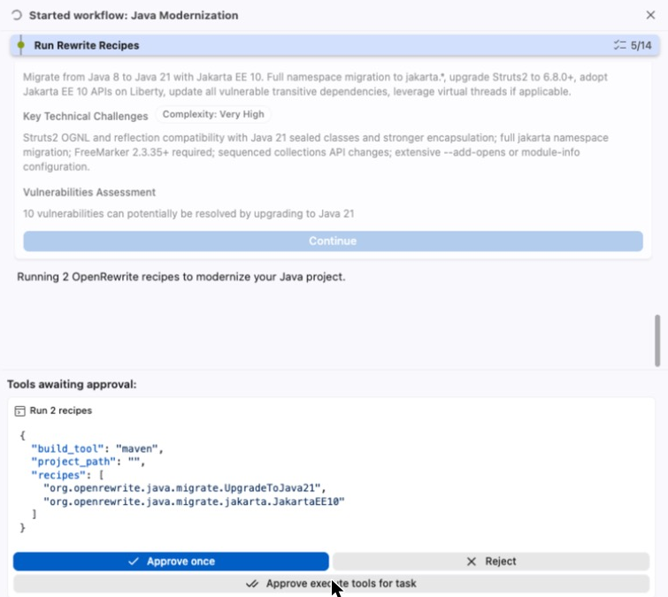

Bob then rebuilds under Java 21 (approve it): *0 errors, 1 warning*.

### 7. Approve the Javassist fix
<sub>⏱ About 5 minutes</sub>

Bob starts a **Fix build issues** sub-agent for the warning. Watch how it works:
1. Reads `pom.xml` and explains the cause — `javassist 3.20.0-GA`, pulled in through `struts2-core → ognl`, has POM problems on Java 21
2. Runs `mvn dependency:tree` to confirm before changing anything
3. Proposes a `<dependencyManagement>` block pinning javassist to `3.29.2-GA`, and asks

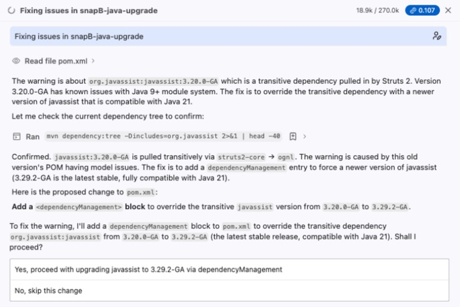

Choose **Yes, proceed**. Bob then opens a side-by-side diff of `pom.xml` and waits for **Approve once** on *Apply Diff*:

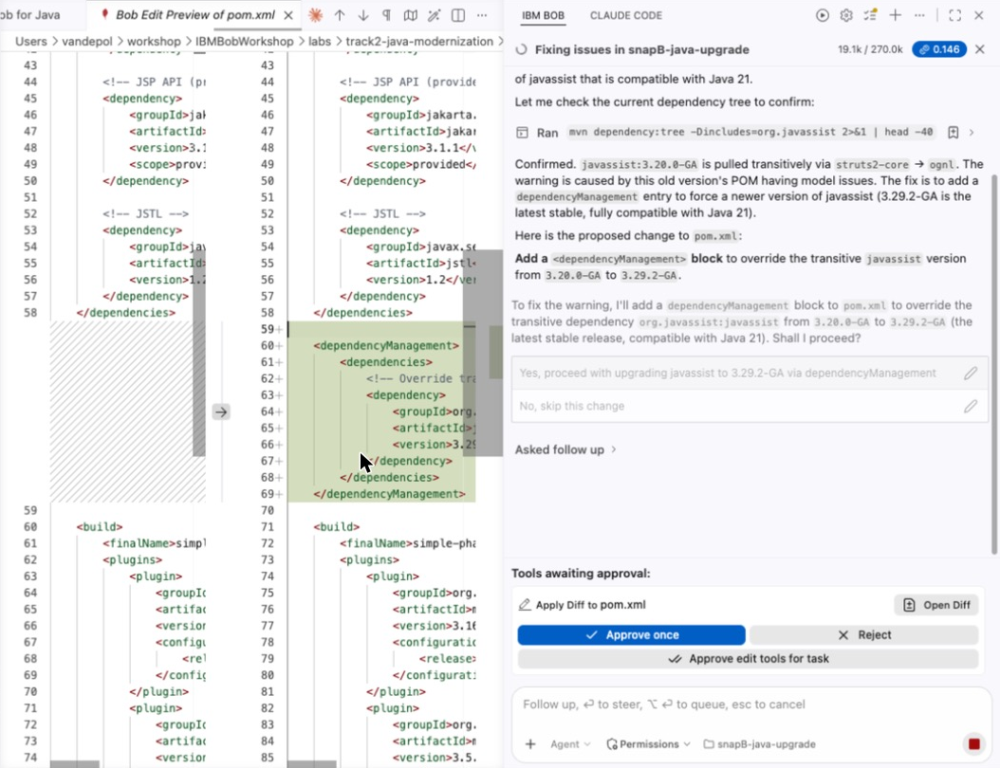

**Read the rationale before you approve.** A find-and-replace tool would have given you a broken build and an error log. This gave you a diagnosis, a named fix and the exact diff, then waited for a human. Bob re-runs the build and summarises *Change / Root cause / Fix / Validation* in a table.

### 8. Fix the vulnerabilities
<sub>⏱ About 10 minutes</sub>

The workflow hands over to **Java Vulnerability Remediation**, rescans, and asks:

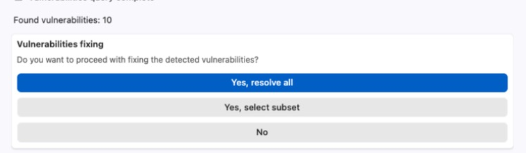

Choose **Yes, resolve all**. Bob plans the fixes (under a minute), then runs a **Fix Vulnerabilities** sub-agent. Approving its tools for the task keeps it moving. Expect:
- Struts `2.5.33` → `6.8.0`
- `<dependencyManagement>` overrides for commons-fileupload, commons-io, FreeMarker and commons-lang3, each commented with its GitHub advisory ID

> 🚩 When a sub-agent finishes its write-up it can stop with an **End subtask** link at the bottom right and no spinner. Click **End subtask** — the workflow continues by itself.
>
> 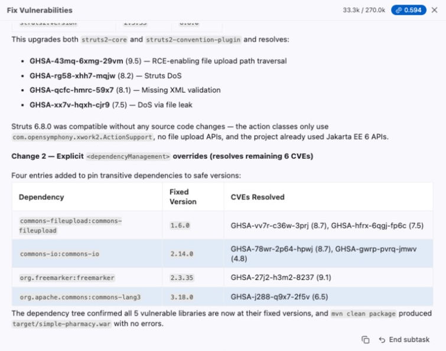

A **Validate Fixes** sub-agent then cross-checks every advisory and ends with *"10 of 10 CVEs addressed"* and `BUILD SUCCESS`:

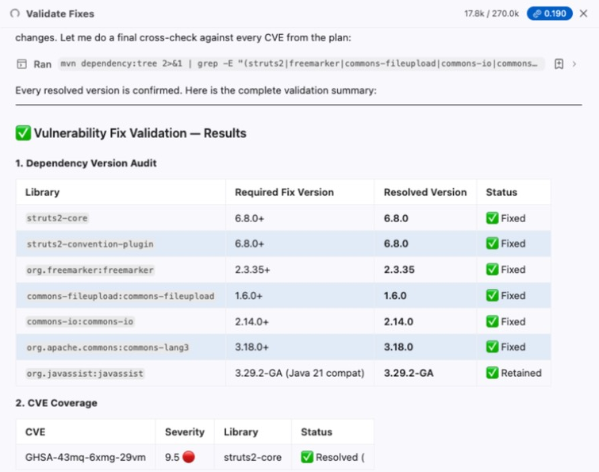

A version upgrade has just turned into a vulnerability remediation, without anyone scoping it as one.

### 9. Final build and summary
<sub>⏱ About 5 minutes</sub>

A **Final step** sub-agent runs `mvn clean compile` under Java 21 (approve it). Then Bob generates a visual modernization summary and a per-task cost breakdown:

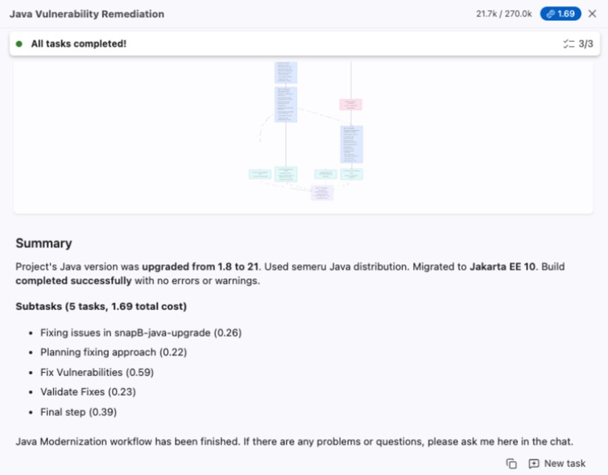

| Look for | Expected |
|---|---|
| Java version | 1.8 → **21**, Semeru |
| Jakarta EE | **10** |
| Build | completed successfully |
| Security | 10 of 10 advisories resolved |
| Cost | about **1.5–5 Bob coins**, itemised per subtask (1.69 in the verification run) |

### ✋ Checkpoint — everyone has a successful build and a summary on screen

---

# Exercise 2: Read what changed

<sub>⏱ About 5 minutes</sub>

Click **Show all** next to *9 files changed* at the bottom of the Bob panel.

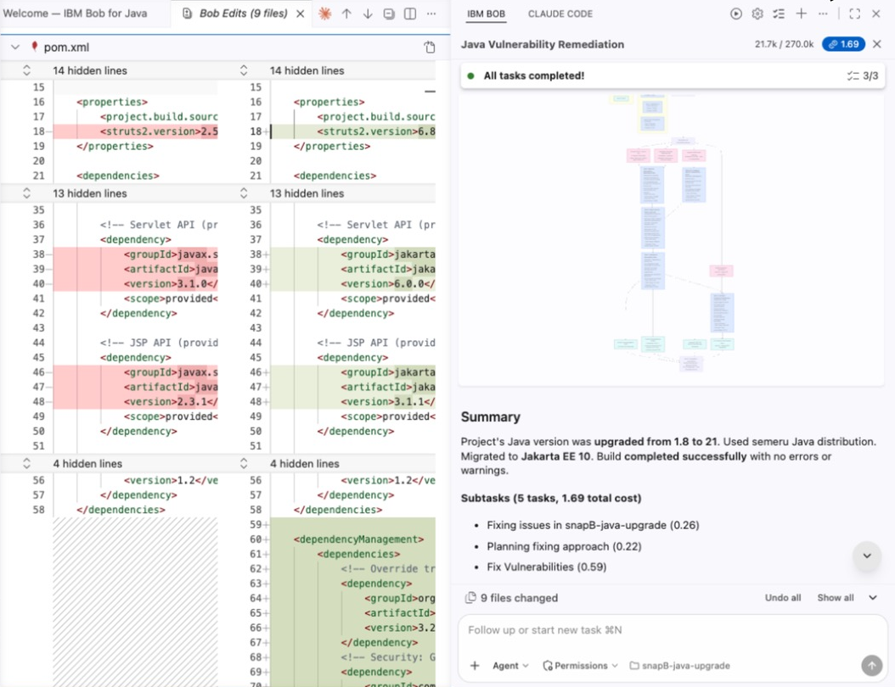

- **`pom.xml`** — `jakarta.servlet-api 6.0.0`, `jakarta.servlet.jsp-api 3.1.1`, Struts `6.8.0`, `<release>21</release>`, and the `<dependencyManagement>` block with the Javassist pin and CVE overrides
- **`web.xml`** — Jakarta EE namespace, version 6.0
- **Action classes** — they never imported `javax.*`, so there's no import swap; the recipe added `@Serial`

Discuss before moving on:
- Would you merge this change?
- How long would this have taken your team, on one application? How many applications does that multiply by?
- Where would you still want a human gate, and did the approvals put one there?

---

# Exercise 3: Run the upgraded application

The build is green. The real test is whether the application runs — and this is where you hand Bob a goal rather than instructions.

### 1. Ask Bob to run it
<sub>⏱ About 2 minutes</sub>

In Bob's chat (with no workflow running), ask what any developer would ask:

```
The Java 21 upgrade builds successfully. Can you start the application on Liberty and make sure the pages work?
```

That's all. No error message, no hints about server features or framework versions. Approve Bob's commands as they come up (*Approve for task* keeps it moving).

### 2. Watch Bob work out what's wrong
<sub>⏱ About 15 minutes</sub>

Bob doesn't know the answer up front, and neither do you need to. Watch how it gets there. In the verification run it went like this:

1. **Reads the project first.** It notices `server.xml` still asks Liberty for `servlet-3.1` and `jsp-2.3` while the code now targets Jakarta EE 10, and updates the features to `servlet-6.0` and `pages-3.1`.

   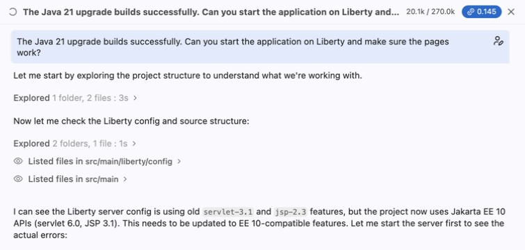

2. **Starts the server and reads the log.** The Struts filter fails to load (`SRVE0321E`). Bob's first theory is the old `javax` JSTL jar; it swaps in the Jakarta one and restarts. The error remains.
3. **Goes deeper instead of guessing again.** It pulls the full stack trace from Liberty's own log and finds the real cause: `ClassNotFoundException: javax.servlet.Filter`.

   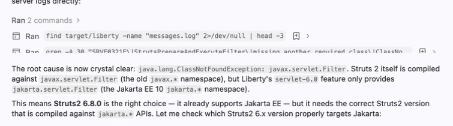

4. **Checks the evidence.** It opens the Struts 6.8 jar, confirms the filter is still built on `javax.servlet`, checks Maven Central, and concludes Jakarta support starts with **Struts 7**.

   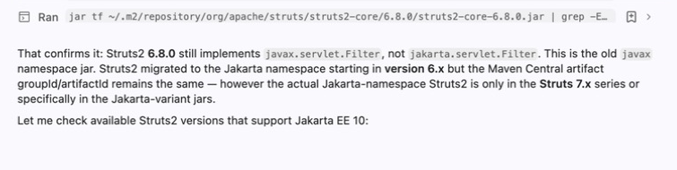

5. **Follows the fallout.** Moving to Struts 7 breaks the build; Bob looks inside the new jar, finds `ActionSupport` moved to `org.apache.struts2`, and fixes all four action classes.

   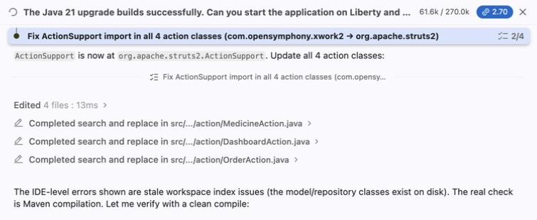

6. **Corrects its own mistake.** It had pointed `struts.xml` at a `struts-7.0.dtd` that doesn't exist; it reads the error, checks which DTDs the jar actually ships, and switches to `struts-6.5.dtd`.

   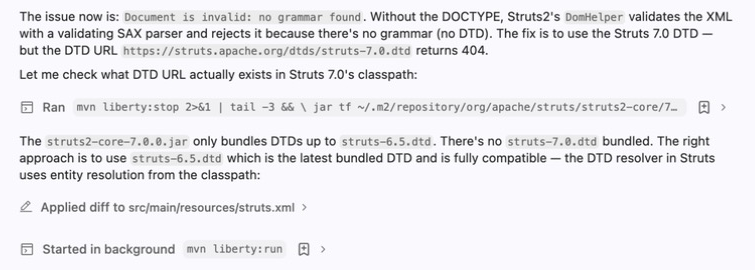

Your run may take a different path — that's the point. Notice the loop: read the evidence, form a theory, test it, adjust.

> 🚩 **Watch what you approve.** In the verification run Bob proposed `pkill -f "liberty:run"` to stop its server — that stops *every* Liberty server on the machine. Reject a command like that; Bob switches to `mvn liberty:stop`, which only stops this project's server.

### 3. Check it against the original
<sub>⏱ About 5 minutes</sub>

Open the dashboard: http://localhost:9081/simple-pharmacy.war/dashboard

The pages load — but compare with what you saw on Java 8. Look closely:
- Does the dashboard list **RX001** as pending, or say *No pending prescriptions*?
- Does **View** on a prescription show the patient, doctor and medicine?

If something's missing, describe the symptom to Bob — the way you'd raise a bug, not a fix:

```
The pages load, but the dashboard says "No pending prescriptions" — on Java 8 it listed RX001.
Opening a prescription shows a "Parameter injection … rejected" message. Can you find out why and fix it?
```

This is the last layer of Struts 7: new security rules that are invisible to the compiler and only show up as missing data at runtime.

### 4. Why the build passed but the app didn't run
<sub>⏱ About 5 minutes</sub>

The Java Upgrade workflow's job ends at a successful build: it rewrites the code, resolves dependencies and vulnerabilities, and proves the result with Maven. Two things sit outside a build, and they only show up when the application is deployed:

1. **Server configuration.** `server.xml` still asked Liberty for the Java EE 7 features, so Liberty refused the Jakarta EE 10 `web.xml`.
2. **Framework generation.** Struts **6.x** is the newest line that keeps the old programming model, which is why the vulnerability fix chose 6.8.0: it closes every advisory and the action classes compile unchanged. But Struts 6 is still built on `javax.servlet`. **Struts 7** is the first release built for Jakarta EE, and it's a migration rather than a version bump — a package move, plus security rules that decide which request parameters and which classes a page may touch.

None of this appears at compile time — the application's own code never touches the servlet API — so the build was genuinely green. That's normal in modernization work: **build-green and deploy-green are two milestones**. The workflow got you the first; Bob, given a plain goal, worked out the second.

### 5. Verify the application
<sub>⏱ About 5 minutes</sub>

Check that the upgraded application behaves like the Java 8 one:
- The dashboard shows **3** prescriptions with **RX001** pending
- **View** on a prescription shows the patient, doctor and medicine
- **Create Prescription** offers 9 medicines, saves, and the new row appears in the list
- **Validate** on RX001 removes it from the dashboard's pending list

Stop the server when you're done (`mvn liberty:stop`, or `./stop-liberty.sh`).

### ✋ Checkpoint — the pharmacy runs on Java 21, Jakarta EE 10 and Struts 7

<details>
<summary>Instructor reference: the changes that make it run</summary>

Use this to coach a stuck table, not as the prompt. Bob may choose different but equivalent fixes (for example, swapping in the Jakarta JSTL jar instead of removing the unused one).

| File | Change | Why |
|---|---|---|
| `server.xml` | `servlet-3.1` → `servlet-6.0`, `jsp-2.3` → `pages-3.1` | Liberty must provide Jakarta EE 10 |
| `pom.xml` | `struts2.version` → 7.x (7.4.0 verified); replace or remove `javax.servlet:jstl` | Struts 7 is built on `jakarta.servlet`; no JSP actually uses JSTL |
| 4 action classes | `import org.apache.struts2.ActionSupport;` | The class moved in Struts 7 |
| 4 action classes | `@StrutsParameter` on every setter that receives a request parameter | Without it, forms and detail pages lose their input |
| `struts.xml` | DOCTYPE stays on `struts-6.0.dtd` or `struts-6.5.dtd` (there is no 7.0 DTD); allowlist `com.pharmacy.model` and `java.util.ArrayList,java.util.List,java.util.Collection` | Without the allowlist, JSPs show blank fields and an empty dashboard list |

```xml
<!-- struts.xml -->
<constant name="struts.allowlist.packageNames" value="com.pharmacy.model" />
<constant name="struts.allowlist.classes" value="java.util.ArrayList,java.util.List,java.util.Collection" />
```
```java
// each action class with setters
import org.apache.struts2.interceptor.parameter.StrutsParameter;

    @StrutsParameter
    public void setPrescriptionId(String prescriptionId) { ... }
```

The allowlist and `@StrutsParameter` are Struts 7 security features — allow what the app needs; don't switch them off.
</details>

---

# Troubleshooting

| Symptom | What to do |
|---|---|
| No **Java Modernization** in the workflow list | Your Bob team lacks the Premium Package for Java, or you opened the parent folder instead of `snapB-java-upgrade` |
| *"SDKMAN requires Bash 4 or higher"* / *"Failed to install SDKMan: true"* | macOS ships Bash 3.2: `brew install bash`, open a new terminal, click **Retry** |
| `sdk install java 8.0.xxx-zulu` → *not a valid candidate version* | Use the newest `8.0.x-zulu` from `sdk list java` |
| Only **Java 25** offered in *Java Version* | The project is already on Java 21 from an earlier run. Reset it: `git checkout -- . && git clean -fd` in the lab folder, or re-extract the folder if you downloaded a zip |
| Agent steps finish instantly, *"Request Failed — An unexpected error occurred"*, Usage stays at `0.0000` | Bob's session is stale. **Sign out of Bob and sign back in**, then retry |
| A sub-agent's write-up ends and nothing happens | Click **End subtask** at the bottom right |
| *Command cancelled* | Something was typed in chat while a command awaited approval. Ask Bob to continue, then approve again |
| Original app fails to start with an ASM / bytecode error | Maven is running a JDK newer than Java 21 (often Homebrew's). Point `JAVA_HOME` at Java 8 for the baseline run |
| *Medicines → View* fails | Pre-existing: `medicine-view.jsp` was never written. Happens on Java 8 too |
| `CWWKC2263E … version 60 … higher than … 31` | Liberty still has the Java EE 7 features (Exercise 3) |
| `FileNotFoundException: …/dtds/struts-7.0.dtd` | There's no 7.0 DTD. Use `struts-6.5.dtd` in `struts.xml` |
| Bob proposes `pkill -f "liberty:run"` | Reject it — it stops every Liberty server on the machine. Ask for `mvn liberty:stop` |
| `SRVE0321E: The [struts2] filter did not load` and every page returns 500 | Struts 6 on a Jakarta EE 10 server: move to Struts 7 (Exercise 3) |
| *"Parameter injection for method [setX] … rejected"* on a page | Add `@StrutsParameter` to that setter |
| Detail pages show blank fields, or the dashboard says *No pending prescriptions* | Add the `struts.allowlist.*` constants to `struts.xml` |
| `mvn` reports Java 1.8 after the upgrade | Open a new terminal, or `sdk use java 21.0.12-sem` (SDKMAN Semeru IDs end in `-sem`) |
| Port 9081 already in use | `./stop-liberty.sh` in the project folder |

---

# Conclusion

You have:
- ✅ Run Bob's Java Modernization workflow from analysis to summary
- ✅ Approved a diagnosed dependency fix after reading the diff
- ✅ Turned a Java upgrade into a vulnerability remediation — 10 advisories closed, each one named
- ✅ Read a per-task cost breakdown
- ✅ Watched Bob take the application from *builds* to *runs* — from a one-line request

Bring one surprise and one criticism to the regroup. The criticism is the more useful of the two.

---

# Optional extras

- **Audit the namespace migration** — ask Bob: *"Audit all imports and configuration for remaining `javax.*` references that should be `jakarta.*`."*
- **Fix the pre-existing bug** — ask Bob: *"Medicines → View fails. Can you find out why and fix it?"*
- **Lab 4 — unit test generation** (`Bobathon/labs/lab4-unit-test-generation/LAB4-GUIDE.md`). For a quick run, set *Candidate Selection Strategy* to the `com.pharmacy.repository` package.
- **Lab 5 — security vulnerability remediation** (`Bobathon/labs/lab5-security-vulnerability-remediation/LAB5-GUIDE.md`) — SQL injection, XSS and input validation.
- **Lab 3 — UI modernization** (`Bobathon/labs/lab3-ui-modernization/LAB3-GUIDE.md`). Needs Node.js/npm and Docker; the guide builds a React + Material UI front end, not Angular.
- **Lab 1 — WebSphere to Liberty** (`Bobathon/labs/lab1-java-liberty-replatforming/LAB1-GUIDE.md`). In Bob 2.2.1 the option is called *Liberty Modernization*; open the `snapA-java-liberty-replatforming` folder.
